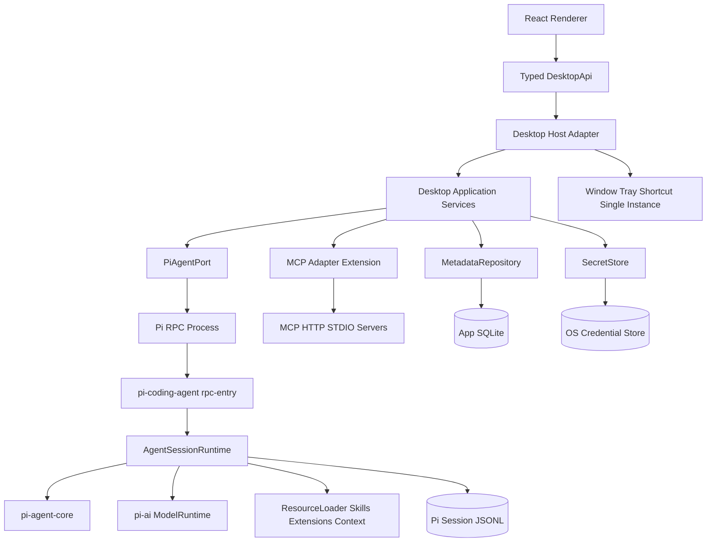

# Pi 桌面端 AI Agent 实现方案

> 本文是基于 `doc/feature.md`、`doc/pi-project-architecture-analysis.md` 以及当前仓库源码的实现规划。当前阶段只做方案设计，不包含代码实现。

## 1. 目标与设计结论

### 1.1 产品目标

构建一个同时支持 Windows 和 macOS 的桌面端 AI Agent，提供以下主流程：

1. 用户通过全局快捷键唤起应用。
2. 选择或创建一个本地项目目录。
3. 在项目下创建、浏览和继续对话。
4. 通过可切换的 OpenAI 兼容模型进行流式对话。
5. 通过 Skills、MCP 和全局约束扩展 Agent 行为。
6. 关闭窗口时驻留系统托盘，可从托盘重新打开、进入设置或退出。

### 1.2 总体实现结论

- **Pi 作为 Agent 内核**：复用 `@earendil-works/pi-coding-agent`、`pi-agent-core`、`pi-ai`、资源加载和会话机制，不在桌面端重新实现 Agent loop、模型适配或 Skill 解析。
- **桌面端通过适配层调用 Pi**：优先使用 Pi 的 `--mode rpc` JSONL 接口。桌面 UI 不直接依赖 Pi 内部类型，只依赖自有的 `DesktopApi` 和领域模型。
- **桌面端拥有应用编排职责**：项目注册、当前项目、窗口/托盘/快捷键、设置页、模型配置界面、会话索引、MCP 生命周期和安全策略由桌面端负责。
- **会话内容以 Pi 会话文件为准**：Pi 的 JSONL 会话文件保存完整消息树、分支、压缩和模型变更；桌面端数据库只保存项目与会话索引，不重复保存完整消息正文。
- **MCP 单独实现为 Pi 扩展/适配器**：当前 Pi README 明确说明核心不内置 MCP，因此 MCP 不能假设由 `coding-agent` 自动提供，需要新增 MCP client、工具注册和配置管理。
- **所有平台能力抽象成端口**：窗口、托盘、快捷键、目录选择器、凭据存储和 Pi 进程均通过接口隔离，以便 Tauri/Electron 之间切换以及后续测试替身。

## 2. 当前仓库基线与影响

### 2.1 可直接复用的能力

| 仓库能力 | 复用方式 | 对桌面端的价值 |
| --- | --- | --- |
| `packages/coding-agent` | 使用 SDK 或 RPC | 会话编排、资源加载、模型选择、Skills、系统提示、工具执行 |
| `packages/agent` | 由 `coding-agent` 间接使用 | Agent turn、流式事件、工具调用、steer/follow-up |
| `packages/ai` | 由 `ModelRuntime` 使用 | Provider、API key、OpenAI 兼容模型、流式请求 |
| `packages/coding-agent/src/modes/rpc` | 作为桌面端进程协议 | prompt、abort、模型/思考级别切换、会话恢复、消息和命令查询 |
| `packages/server/src/rpc-process.ts` | 参考或抽取为共享实现 | 子进程启动、JSONL 解析、请求关联、事件转发、退出处理 |
| `ResourceLoader` / `SettingsManager` | 通过 Pi runtime 配置 | 全局/项目上下文文件、Skills、Prompt、扩展、设置合并 |
| `SessionManager` / JSONL | 保持 Pi 为事实源 | 会话树、分支、恢复、导入导出、压缩 |
| `packages/storage/sqlite-node` | 可选用于 Node 宿主；不强制用于 Tauri Rust | 查询和物化会话的参考实现 |
| `packages/protocol` | 后续多会话服务化可复用 | 如果从单 RPC 进程升级为常驻 server，可沿用协议思想 |

### 2.2 需要新增或补齐的能力

- 桌面 shell：窗口、托盘、全局快捷键、单实例、平台权限和打包。
- React 桌面 UI：项目/会话侧栏、消息流、输入框、设置页、模型和 Skill 选择器。
- 应用层数据模型与本地数据库：项目、会话索引、桌面设置、MCP 配置。
- Pi RPC 客户端和事件归一化层。
- API key 的 OS 安全存储与 Pi runtime 凭据注入。
- MCP client、工具转换、连接生命周期和权限策略。
- 面向桌面的错误、日志、诊断和恢复机制。

### 2.3 重要限制

1. Pi 当前 RPC 协议支持 `thinkingLevel`，但没有通用的 `temperature`、上下文长度等桌面级参数设置命令。第一版应把“模型强度”定义为 Pi 的思考级别；其他参数要么在模型配置中固定，要么在确认协议扩展后再开放。
2. Pi 的扩展和项目资源可执行任意代码，且项目资源存在信任边界。桌面端不能为了方便而默认信任所有项目。
3. Pi 核心没有内置 MCP。MCP 是本项目的新增子系统，必须有独立的安全、超时、取消和版本策略。
4. Tauri 不能直接运行 Node/TypeScript 包。若采用 Tauri，需要打包并管理 Node/Bun sidecar；这必须在实现前做可运行的跨平台 spike。

## 3. 范围、优先级与非目标

### 3.1 P0：首个可交付版本必须具备

- Windows/macOS 单实例桌面窗口。
- 窗口最小化、最大化/还原、关闭到托盘。
- 托盘打开、设置、退出菜单。
- 全局唤起快捷键，默认 Windows `Ctrl+Shift+0`、macOS `Cmd+Shift+0`，可修改并即时重新注册。
- 项目目录添加、切换和基本信任确认。
- 新建/加载/继续对话；左侧显示按项目分组的历史。
- Pi Agent 流式输出、停止、错误显示和基本消息复制。
- 模型配置的添加、编辑、删除、默认模型切换。
- API key 不进入渲染进程、不写入普通日志，使用系统安全存储。
- 全局 System Prompt 配置，并对新建或重新初始化的 runtime 生效。
- Skill 目录发现、`/` 候选、键盘/鼠标选择和 Pi 命令执行。

### 3.2 P1：首个版本后补齐

- MCP STDIO 和 HTTP 传输。
- MCP Server 启停、工具列表、连接状态、超时和用户确认。
- 会话树可视化、分支、导出和更细的消息操作。
- 自动恢复崩溃的 Pi 进程和断线后的状态重放。
- 更完整的模型能力参数（如 provider-specific request options）。
- 启动时运行、通知、主题和可选的项目级设置。

### 3.3 明确非目标

- 不在第一版实现云端同步、账号体系或多设备会话同步。
- 不重写 Pi 的 Agent loop、模型 provider 或 Skill 规范。
- 不默认提供任意第三方扩展市场；扩展安装必须经过明确的用户操作和信任确认。
- 不把完整会话消息同时写入两套持久化系统。
- 不在没有安全策略的情况下开放任意 MCP 工具或后台执行。

## 4. 技术选型与决策门禁

### 4.1 桌面壳

需求文档推荐 Tauri 2，但当前仓库是 Node/TypeScript monorepo。建议按以下方式决策：

| 方案 | 优点 | 主要风险 | 方案定位 |
| --- | --- | --- | --- |
| Tauri 2 + Pi Node/Bun sidecar | 体积较小、内存占用低、原生窗口/托盘能力好 | sidecar 打包、Node 运行时、签名和跨平台路径处理复杂 | 产品目标方案，需先通过 spike |
| Electron + Pi RPC 子进程 | Node 集成直接，复用现有 RPC/Node 生态最快 | 包体积和资源占用较大，原生模块兼容需验证 | Tauri spike 失败时的可靠 fallback |

**建议默认目标为 Tauri 2，但在阶段 P0 做壳层决策门禁**：

1. 在 Windows 和 macOS 各启动一次已打包的 Pi RPC sidecar。
2. 完成 `prompt -> 流式事件 -> abort -> new session` 最小链路。
3. 验证 API key 注入、SQLite/应用数据目录、托盘和全局快捷键。
4. 如果 sidecar、签名或 Node 运行时打包无法稳定解决，则切换到 Electron，保持上层 `DesktopApi` 和 `PiAgentPort` 不变。

### 4.2 前端与状态

- React + TypeScript + Vite。
- Zustand 管理渲染层状态；领域业务状态由应用服务维护，避免把 Pi 原始对象直接塞进 UI store。
- UI 采用自定义极简工具风格。Tailwind 可作为样式工具，但组件应保持小而明确，不引入与需求无关的重型设计系统。
- 图标使用现有图标库；窗口按钮、设置、添加项目、发送、停止等操作必须有可访问名称和 tooltip。

### 4.3 本地数据

- **Pi 会话 JSONL**：完整 transcript、会话树和恢复依据。
- **应用 SQLite**：项目、会话索引、设置版本、模型非敏感元数据、MCP 配置元数据、迁移记录。
- **OS Secret Store**：API key、MCP 环境变量中的 secret 等敏感值。
- SQLite 的具体驱动由宿主决定：Tauri 可使用经过审查的 SQLite 插件；Node 宿主可复用 `packages/storage/sqlite-node` 的接口。桌面领域层只依赖 `MetadataRepository`，不依赖具体驱动。

### 4.4 Pi 接入模式

统一定义桌面端自有 `PiAgentPort`：

- `start(cwd, sessionTarget, runtimeOptions)`
- `prompt(message, queueMode?)`
- `steer(message)` / `followUp(message)` / `abort()`
- `getState()` / `getMessages()` / `getEntries()` / `getTree()`
- `setModel(provider, modelId)` / `setThinkingLevel(level)`
- `getAvailableModels()` / `getAvailableThinkingLevels()` / `getCommands()`
- `newSession()` / `switchSession(path)` / `setSessionName(name)`
- `subscribe(listener)` / `dispose()`

该接口下面可有两个实现：

1. `RpcPiAgentPort`：通过 LF 分隔 JSONL 调用 `pi --mode rpc`，Tauri 和 Electron 均可使用。
2. `EmbeddedPiAgentPort`：仅 Node 宿主可选，直接使用 `createAgentSession`/`AgentSessionRuntime`，用于性能优化或测试。

首版默认使用 RPC 实现，避免桌面 UI 与 Pi 内部实现绑定，并便于后续把 agent 放入独立进程。

## 5. 总体架构



### 5.1 分层职责

| 层 | 主要模块 | 允许依赖 | 禁止承担的职责 |
| --- | --- | --- | --- |
| Renderer UI | 页面、组件、Zustand store、渲染模型 | `DesktopApi`、共享 schema | 直接读文件、读 API key、直接调用 Pi 内部类 |
| Desktop API | 渲染器可调用的命令和事件 | 共享 schema | 业务规则和持久化细节 |
| Application | 项目、会话、模型、Skills、MCP 编排 | 端口接口、repository | Tauri/Electron API、React 组件 |
| Pi Adapter | RPC/SDK 适配、事件归一化、重连 | Pi RPC/SDK 类型 | UI 状态、项目列表展示 |
| Persistence | SQLite 元数据、会话索引、迁移 | SQLite driver、文件 API | Agent 执行和 UI |
| Shell | 窗口、托盘、快捷键、目录选择、单实例 | Tauri/Electron API | Pi prompt 业务和消息格式化 |
| MCP | Server 配置、连接、工具 schema 转换、策略 | MCP SDK、Pi ExtensionAPI | 修改项目或绕过全局安全策略 |

### 5.2 进程模型

首版采用“一窗口 + 一个活动项目 runtime”的模型：

- 桌面 host 只维护当前活动项目的 Pi RPC 子进程。
- 同一项目内切换历史会话使用 `switch_session`，不创建新的 agent 进程。
- 切换项目时先 abort/flush 当前 runtime，再停止或挂起旧进程，启动新项目 runtime。
- 后续需要同时运行多个项目时，引入 `ProjectRuntimePool`，每个项目一个受限数量的 RPC 实例，并配置空闲回收。
- 所有进程退出、断线和重启都通过 `RuntimeSupervisor` 管理，不能由 Renderer 自行 spawn。

这样既复用了当前 RPC 模式，也避免第一版同时处理多进程会话锁、并发输出和资源生命周期。

### 5.3 建议目录落位

当前仓库使用 `packages/*` workspace，桌面端建议新增一个应用和若干可测试的共享包。不要把所有逻辑堆在 Tauri command 或 Electron main 中。

```text
apps/pi-desktop/
├── src/
│   ├── renderer/                 # React 页面、组件、Zustand store
│   ├── host/                     # DesktopApi 组装和宿主生命周期
│   └── shared/                   # 应用入口级常量和资源
├── src-tauri/                    # Tauri 2 壳；Electron fallback 可有对应 host
│   ├── src/                      # 窗口、托盘、快捷键、sidecar、命令
│   └── capabilities/             # 最小权限配置
└── assets/                       # 图标、安装包资源

packages/pi-desktop-protocol/
└── src/                          # 命令、事件、错误码、schema、版本

packages/pi-desktop-core/
└── src/
    ├── application/              # 项目/会话/模型/设置/MCP 用例
    ├── domain/                   # 实体、值对象、状态机
    ├── ports/                    # Pi、shell、storage、secret 接口
    └── errors/                   # 稳定错误码和错误映射

packages/pi-desktop-pi-bridge/
└── src/
    ├── rpc/                      # JSONL client、request map、进程退出
    ├── normalize/                # Pi event -> desktop event
    └── fake/                     # 测试用 PiAgentPort

packages/pi-desktop-storage/
└── src/
    ├── sqlite/                   # 应用元数据 schema 和 migration
    ├── sessions/                 # Pi session JSONL 索引/重建
    └── adapters/                 # Tauri/Node SQLite driver

packages/pi-desktop-mcp/
└── src/
    ├── client/                   # STDIO/HTTP 连接
    ├── tools/                    # MCP schema 与 Pi tool 转换
    ├── policy/                   # trust、consent、超时和输出限制
    └── extension/                # 向 Pi 注册受控工具的 extension
```

目录命名可根据最终包发布策略调整，但依赖方向应保持：`renderer -> desktop-core/protocol`，`desktop-core -> ports`，各平台 host 和 Pi/MCP/storage adapter 实现 ports；领域层不能反向依赖 Tauri、Electron 或 React。

## 6. 领域模型与持久化

### 6.1 核心实体

```text
Project
  id: string
  name: string
  rootPath: string
  trustState: "unknown" | "trusted" | "untrusted"
  createdAt / updatedAt / lastOpenedAt

ConversationIndex
  id: string
  projectId: string
  sessionPath: string
  title: string
  createdAt / updatedAt
  modelProvider / modelId / thinkingLevel
  leafId: string | null
  status: "idle" | "streaming" | "error"

ModelProfile
  id: string
  providerId: string
  displayName: string
  baseUrl: string
  modelId: string
  capabilities: structured metadata
  enabled: boolean
  credentialRef: string
  createdAt / updatedAt

AppSettings
  globalSystemPrompt: string
  invokeShortcut: platform-aware shortcut
  defaultModelProfileId: string | null
  closeToTray: boolean
  schemaVersion: number

McpServerProfile
  id: string
  name: string
  transport: "stdio" | "http"
  endpoint or command metadata
  enabled: boolean
  credentialRefs: string[]
  trustState: "unknown" | "trusted" | "blocked"
  lastStatus / lastError
```

API key、MCP token 和环境变量值只能用 `credentialRef` 引用，不得出现在 `ModelProfile`、SQLite 普通字段、Renderer store 或日志中。

### 6.2 存储规则

1. 应用数据目录使用平台规范路径，启动时创建并执行 schema migration。
2. 项目根目录必须经过 canonical path 校验；不允许通过 `..`、符号链接或相对路径绕过项目边界。
3. 会话索引保存 `sessionPath` 和摘要字段；打开详情时向 Pi 请求 `get_messages`/`get_entries`，必要时刷新索引。
4. Pi 会话 JSONL 是唯一的消息事实源。SQLite 只保存可重建索引，索引损坏时可通过扫描项目会话目录重建。
5. 删除项目默认只删除应用索引，不删除用户项目目录和 Pi 会话文件；删除会话也必须单独确认。
6. 所有迁移都有单调递增版本号、幂等执行和失败回滚/备份策略。

### 6.3 会话与项目关联

- 项目创建后，为该项目建立专用 session directory，避免所有项目共享一个历史列表。
- `ConversationIndex.sessionPath` 指向 Pi session 文件，`projectId` 是桌面索引关联。
- 新建会话调用 `new_session`，成功后立即写入索引并设置标题；标题优先使用用户命名，否则由第一条用户消息生成截断摘要。
- 加载历史时先读索引，再用 Pi `switch_session` 和 `get_messages` 恢复内容；若文件不存在，显示“会话文件缺失”，不静默创建空会话覆盖原索引。
- 分支会话保留 Pi 的树结构；P0 只显示当前叶子，P1 再提供分支选择和可视化。

## 7. Pi 集成实现细节

### 7.1 RPC 生命周期

1. `RuntimeSupervisor` 根据项目 `cwd` 和 session directory 启动 `pi --mode rpc`。
2. 进程 stdin/stdout 使用严格 LF JSONL；不能使用会按 Unicode 行分隔符切分的通用 reader。
3. 每个命令生成 request id，维护 pending map、超时和进程退出时的统一 reject。
4. stdout 中的 `response` 按 request id 归还；AgentSession event 和 extension UI request 转成桌面事件。
5. stderr 单独缓冲，错误展示只截断后的安全文本；不能把 API key 或命令环境变量写入日志。
6. 进程启动后顺序执行 `get_state`、`get_messages`、`get_commands`，完成后再允许输入框发送。
7. 进程异常退出时标记 runtime error，保留当前 UI 消息，尝试一次可控重启并通过 snapshot 重放；连续失败则要求用户重试，不自动循环。

### 7.2 事件归一化

Pi 的事件类型不直接暴露给 Renderer。适配层统一为：

- `runtime_started` / `runtime_ready` / `runtime_stopped` / `runtime_error`
- `session_state_changed`
- `message_started` / `message_delta` / `message_finished`
- `thinking_delta`
- `tool_started` / `tool_update` / `tool_finished`
- `turn_started` / `turn_finished`
- `session_compacted`
- `extension_ui_request`
- `diagnostic`

Renderer 根据事件增量更新临时消息；每个 turn 完成后再用必要的 snapshot 对齐，避免流式事件丢失导致 UI 与会话文件不一致。

### 7.3 Prompt 队列语义

- 空闲时发送使用 `prompt`。
- Agent streaming 时，发送按钮显示队列选项：`steer` 用于当前 turn 后立即处理，`followUp` 用于当前任务完成后处理。
- 未选择队列策略时禁止直接发送，避免触发 Pi RPC 的 preflight error。
- `abort` 只终止当前 Agent turn，不删除已持久化消息；UI 显示 aborted 状态。
- 同一时刻只允许一个 prompt/steer/follow-up 请求写入 stdin，保证请求顺序；事件处理可以异步渲染。

### 7.4 Pi 资源与全局约束

- 全局约束由桌面设置保存，启动 runtime 时通过 Pi `ResourceLoader` 的 system prompt/append system prompt 配置注入。
- 项目 `AGENTS.md`、`CLAUDE.md`、`.pi/skills` 和 `.pi/extensions` 继续使用 Pi 的发现规则。
- 资源加载前先检查项目 trust 状态；未信任项目只加载用户级资源和明确允许的资源，不能自动执行项目扩展。
- 设置页修改全局约束后，默认对新建 runtime 生效；当前会话是否立即重载必须在 UI 中明确提示，避免隐式改变已有上下文。
- 资源诊断、冲突和加载失败进入 `diagnostic` 事件，并在设置或项目状态区域可查看。

## 8. MCP 设计

### 8.1 基本策略

Pi 当前明确“不内置 MCP”，因此新增 `desktop-mcp` 适配层，作为 Pi extension 或 host-side adapter 注册工具。推荐先做 host-side adapter，再通过受控的 Pi ExtensionAPI 注册工具，原因是连接生命周期和凭据不应由 Renderer 管理。

### 8.2 支持范围

P1 首批支持：

- STDIO：命令、参数、工作目录和非敏感环境变量。
- HTTP：endpoint、请求超时和认证引用。
- 初始化、工具发现、工具调用、连接关闭和重连。
- 工具 schema 转换成 Pi `ToolDefinition`，工具结果转换成 Pi tool result。
- 单工具超时、总调用超时、取消信号和最大输出大小。
- Server 启用/禁用、工具列表、连接状态和最近错误。

暂不支持：

- 资源订阅、提示词模板同步、Roots 等高级能力，除非经过单独评估。
- 未经确认的任意文件写入、网络请求或后台长任务。

### 8.3 安全与生命周期

1. Server 配置分为普通配置和 secret 引用；secret 只从 `SecretStore` 读取。
2. Server 第一次启用、工具权限变化或项目切换时执行 trust/consent 检查。
3. 工具名加 server namespace，避免不同 Server 的命名冲突。
4. 连接按项目 runtime 生命周期启动和关闭；项目切换时不遗留子进程。
5. 所有工具调用记录结构化诊断，但只记录名称、耗时、状态和截断后的非敏感摘要。
6. MCP 连接和工具错误不能让整个 Agent runtime 崩溃；以可见的 tool error 返回模型。

## 9. 桌面功能实现方案

### 9.1 启动、单实例与窗口

- 启动时先获取单实例锁；第二次启动只向已有实例发送 `show_or_toggle` 事件并退出。
- 主窗口创建后设置最小尺寸、默认尺寸和平台标题栏策略。
- 窗口状态（尺寸、位置、最大化）保存为非敏感桌面设置，并在下一次启动时校验屏幕边界。
- 关闭按钮默认触发 `hide_to_tray`，不杀掉 Pi runtime；真正退出只能来自托盘菜单或设置中的退出入口。
- 最小化和隐藏是不同状态：最小化保留窗口任务栏项，隐藏到托盘不保留前台窗口。

### 9.2 全局快捷键

- 默认 Windows `Ctrl+Shift+0`，macOS `Cmd+Shift+0`；配置模型保存平台归一化后的组合键。
- 快捷键服务只负责注册/注销/冲突错误，不持有聊天业务。
- 首次按下：显示并聚焦窗口；无活动会话时创建会话。
- 再次按下：隐藏窗口；若当前窗口已隐藏则显示并聚焦。
- 设置修改采用“注销旧键 -> 校验新键 -> 注册新键 -> 持久化”的事务流程；注册失败要恢复旧值并给出错误。
- macOS 权限、Windows 冲突和输入法影响均需在 P0 手工验证。

### 9.3 托盘

- 托盘菜单固定提供：打开、设置、退出。
- “打开”显示并聚焦窗口；“设置”显示窗口并导航到设置页；“退出”先停止活动 runtime，再关闭托盘和主进程。
- 托盘菜单不显示 API key、项目路径等敏感信息。
- macOS 菜单栏图标和 Windows 托盘图标使用不同资源，但由统一 `TrayPort` 暴露相同语义。

### 9.4 主聊天页

布局分成侧栏、聊天区和输入区：

- **侧栏**：项目标题和添加按钮；项目列表；当前项目的会话历史；底部设置入口。
- **聊天区**：用户消息、思考内容、AI 文本、工具调用状态、错误和取消状态；流式 delta 不改变布局跳动。
- **输入区**：多行输入，垂直拖拽调整高度，焦点和发送状态明确；输入区底部显示模型、思考级别和发送/停止操作。
- **Skill 候选**：输入以 `/` 开始时展示当前 `get_commands` 结果；支持过滤、上下键、Enter/鼠标选择、Escape 关闭；选择后插入完整命令前缀，后续文本仍由 Pi 展开。
- **消息操作**：P0 支持复制；重新生成要定义为从该消息分支或重发，避免隐式覆盖历史，建议放到 P1。

### 9.5 设置页

分为四个独立区域，保存采用表单级校验和显式反馈：

1. **模型**：列表、添加、编辑、删除、启用/禁用、默认模型、连接测试；API key 只显示掩码，编辑时不回填明文。
2. **快捷键**：当前组合键、冲突/注册状态、恢复默认。
3. **全局约束**：多行编辑、字符统计、保存/恢复默认；提示作用于新 runtime 或当前会话重载的范围。
4. **Skills/MCP**：Skills 目录添加/删除和重新扫描；MCP Server 配置、启停、工具列表和错误状态。

## 10. Desktop API 与 IPC 契约

Renderer 只调用自有的类型化 API。建议按领域划分命令：

### 10.1 窗口与应用

- `window.show()` / `window.hide()` / `window.toggle()` / `window.minimize()` / `window.maximize()` / `window.closeToTray()`
- `app.openSettings()` / `app.quit()` / `app.getDiagnostics()`

### 10.2 项目与会话

- `projects.list()` / `projects.addFromFolder()` / `projects.select(id)` / `projects.rename(id, name)` / `projects.remove(id)`
- `sessions.list(projectId)` / `sessions.create(projectId)` / `sessions.open(id)` / `sessions.rename(id, name)` / `sessions.refresh(id)`
- `sessions.getTree(id)` / `sessions.export(id)`（P1）

### 10.3 Agent

- `agent.getState()` / `agent.getMessages()` / `agent.prompt(text, queueMode)` / `agent.abort()`
- `agent.setModel(profileId)` / `agent.setThinkingLevel(level)`
- `agent.getAvailableModels()` / `agent.getCommands()`
- `agent.subscribeEvents(listener)` 使用统一事件 schema，不直接暴露 Pi 原始对象。

### 10.4 设置、模型和 MCP

- `settings.get()` / `settings.update(patch)` / `settings.reset(key)`
- `models.list()` / `models.create()` / `models.update()` / `models.delete()` / `models.testConnection()` / `models.setDefault()`
- `skills.list()` / `skills.reload()`
- `mcp.list()` / `mcp.create()` / `mcp.update()` / `mcp.delete()` / `mcp.setEnabled()` / `mcp.testConnection()` / `mcp.listTools()`

所有命令必须：

- 在 host 侧做 schema 校验、路径 canonicalization 和权限检查。
- 返回稳定的错误码和用户可读消息，不能把底层 stack 直接发送到 UI。
- 不返回 API key、MCP secret 或完整环境变量。
- 事件携带 `projectId`、`sessionId`、`runtimeId` 和可选 `requestId`，防止切换项目后旧事件污染当前 UI。

## 11. API key 与权限设计

### 11.1 凭据流程

1. 设置页提交 API key 后，host 校验字段和 Base URL，写入 OS Secret Store，得到 `credentialRef`。
2. 普通 SQLite 只保存 `credentialRef` 和 provider 元数据。
3. Pi runtime 启动时由 host 读取 secret，并通过受控的 credential adapter 注入 Pi `ModelRuntime`。
4. 如果 RPC 运行时只能读取 `auth.json`，则在应用专属 agent directory 中生成受 ACL 保护的临时凭据文件，限制权限、避免日志输出，并在 runtime 停止时清理；这一方案必须在 P0 通过安全评审。
5. 删除/更新模型时同步删除或替换 credential reference，不自动删除用户可能复用的其他 provider credential。

### 11.2 项目信任

- 新项目默认为 `unknown`，首次加载 `.pi` 扩展、脚本型 MCP 或需要写入的项目资源时显示信任确认。
- `trusted` 状态按 canonical rootPath 存储；路径移动或符号链接解析变化后重新确认。
- `untrusted` 项目仍可进行只读对话，但禁用未信任扩展和危险工具，具体 allowlist 由 P0 安全评审确定。
- 用户可以在设置或项目菜单中撤销信任。

## 12. 分阶段实施计划

### 阶段 0：架构 spike 与决策门禁

**目标**：在写正式功能前验证最容易失败的跨进程和跨平台部分。

交付物：

- Tauri sidecar 和 Electron fallback 的最小启动样例评估。
- Windows/macOS 上 Pi RPC 的启动、JSONL 解析、流式事件、abort、session switch 验证。
- API key 注入和 OS Secret Store 验证。
- 应用数据目录、SQLite 驱动、会话 JSONL 目录策略验证。
- 全局快捷键、托盘、单实例的两平台行为验证。
- MCP SDK、HTTP/STDIO 传输、Pi ExtensionAPI 接入可行性结论。

退出条件：上述链路在两平台均可重复运行；否则明确切换 Electron 或缩小 P0 范围。

### 阶段 1：工程骨架与共享契约

交付物：

- `apps/desktop` 桌面应用目录和构建脚本。
- `packages/desktop-protocol`：命令、事件、错误码、实体 schema。
- `packages/desktop-core`：领域模型、应用服务接口、端口定义。
- `packages/desktop-pi-bridge`：RPC client、事件归一化和 fake port。
- host/renderer 的安全 IPC 桥接，Renderer 禁止 Node/fs 直连。
- 日志、诊断、request/session/runtime correlation id。

验收：fake Pi port 可驱动 UI 状态；所有 API 命令都有 schema 和错误码；应用可启动并显示空状态。

### 阶段 2：最小纵向链路

交付物：

- 主窗口、单实例、最小化/最大化/关闭到托盘。
- 托盘打开/设置/退出。
- 全局快捷键注册、切换和设置修改。
- 一个项目、一个会话、一次真实 Pi RPC prompt 的完整流式链路。
- 消息渲染、发送、停止、runtime 错误。

验收：不依赖侧栏高级能力即可完成“快捷键唤起 -> 输入 -> AI 流式回复 -> 隐藏 -> 托盘恢复”。

### 阶段 3：项目与会话历史

交付物：

- 项目文件夹选择、canonical path 和 trust UX。
- SQLite 元数据表和迁移。
- 会话索引、创建、打开、重命名和刷新。
- Pi session JSONL 与索引重建。
- 项目切换时 runtime 停止/启动和旧事件隔离。

验收：重启应用后项目和历史可恢复；会话文件缺失有明确错误；切换项目不会串消息。

### 阶段 4：模型、全局约束与输入体验

交付物：

- OpenAI 兼容模型配置 CRUD 和默认模型。
- OS Secret Store、凭据注入、连接测试。
- 模型选择器和 Pi thinking level 选择器。
- 全局 System Prompt 保存和 runtime 注入。
- 输入框高度调整、streaming queue、复制和错误重试入口。

验收：至少验证一个远程 OpenAI 兼容 endpoint 和一个本地 endpoint；API key 不出现在 UI state、日志和普通 DB。

### 阶段 5：Skills 与资源信任

交付物：

- Pi Skill 发现结果映射到 `get_commands`。
- `/` 候选过滤、键盘/鼠标选择和命令发送。
- Skills 目录配置和重新扫描。
- 项目资源 trust 状态、诊断和禁止执行路径。

验收：用户级和项目级 Skill 均能按 trust 规则加载；错误 Skill 不影响普通对话；流式状态下 Skill command 的队列行为符合 RPC 规则。

### 阶段 6：MCP

交付物：

- MCP Server profile、secret reference、启停和连接测试。
- STDIO/HTTP client、工具 schema 转换、工具状态和错误。
- Pi extension 注册、工具调用流式事件、超时/取消/最大输出。
- 项目级 trust/consent 和工具 namespace。

验收：fake MCP server 和至少一个真实 STDIO/HTTP server 都能完成初始化、工具发现、一次成功调用、一次超时和一次取消；关闭项目时无残留子进程。

### 阶段 7：跨平台硬化与发布

交付物：

- Windows/macOS 安装包、签名、资源和卸载策略。
- sidecar/Node 运行时版本固定、升级和失败回滚。
- 崩溃恢复、日志导出、诊断页、数据库迁移备份。
- 键盘冲突、权限、深色/浅色系统主题和高 DPI 验证。

验收：完成两平台安装/升级/卸载、冷启动、托盘驻留、真实模型对话、断网恢复和数据迁移测试。

## 13. 测试与验收策略

### 13.1 单元测试

- 项目路径 canonicalization、trust 决策和会话索引迁移。
- 模型 profile 校验、Base URL 规范化、secret reference 生命周期。
- 快捷键解析、平台默认值和注册失败回滚。
- RPC JSONL framing、request correlation、超时、退出和残留 pending 请求。
- Pi event 到桌面 event 的归一化、乱序/重复事件防护。
- Skill 候选过滤和 slash 输入状态机。
- MCP schema 转换、namespace、超时和取消。

### 13.2 集成测试

- fake Pi RPC server 驱动 prompt、stream、tool、abort、new session、switch session。
- 临时应用数据目录执行 SQLite migration、索引重建和损坏恢复。
- fake SecretStore 验证 Renderer 永远无法读取明文。
- fake MCP server 验证连接和工具调用。

### 13.3 UI/E2E 测试

- 新用户：启动 -> 添加项目 -> 创建会话 -> 发送 -> 流式回复。
- 快捷键：显示/隐藏切换、冲突恢复、窗口关闭到托盘。
- 历史：重启后加载、切换会话、缺失文件错误。
- 设置：模型 CRUD、默认模型、全局约束、Skills/MCP reload。
- 中断和异常：abort、RPC 崩溃、断网、MCP 超时、数据库锁冲突。

### 13.4 平台验收矩阵

| 场景 | Windows | macOS |
| --- | --- | --- |
| 安装、升级、卸载 | 必测 | 必测 |
| 全局快捷键和冲突 | 必测 | 必测，含辅助功能/权限提示 |
| 托盘/菜单栏驻留 | 必测 | 必测 |
| 关闭按钮隐藏 | 必测 | 必测 |
| 高 DPI/Retina 布局 | 必测 | 必测 |
| sidecar 启动和退出 | 必测 | 必测 |
| API key/应用数据权限 | 必测 | 必测 |
| 项目路径、符号链接、权限不足 | 必测 | 必测 |

## 14. 运行观测与错误处理

- 日志采用结构化字段：`timestamp`、`level`、`component`、`projectId`、`sessionId`、`runtimeId`、`requestId`。
- 默认只写本地日志，不上传用户消息、API key、完整工具参数或 MCP secret。
- 错误分为用户可修复（配置、权限、网络）、runtime 可恢复（Pi 进程退出、连接断开）和不可恢复（数据损坏、迁移失败）。
- 所有异步任务支持 `AbortSignal`；窗口关闭到托盘不取消 Agent，应用退出才取消并等待有限时间。
- 长消息、工具输出和 stderr 统一截断，保留原始会话文件，不让 UI 因异常输出失控。
- 诊断页提供版本、平台、runtime 状态、最近错误和日志导出，不显示 secret。

## 15. 主要风险与缓解

| 风险 | 影响 | 缓解 |
| --- | --- | --- |
| Tauri sidecar 打包/签名不稳定 | 无法发布 | 阶段 0 先验证；保留 Electron host adapter |
| Electron/Tauri runtime 与 Node 版本不一致 | Pi 原生依赖或 `node:sqlite` 失败 | RPC sidecar 使用固定 Node/Bun；启动时做版本检查 |
| RPC 只能从文件读取凭据 | API key 泄露或无法多模型 | 设计 SecretStore + credential adapter；P0 安全评审临时 auth 文件 |
| Pi RPC 仅支持单活动 session | 多项目并发受限 | P0 单活动项目；P1 引入 runtime pool/server |
| Pi 核心没有 MCP | P1 工作量和安全面扩大 | 单独 package、先 fake server、明确 transport 和 consent 范围 |
| 项目扩展执行任意代码 | 供应链/代码执行风险 | trust store、默认不信任、资源诊断、安装前确认 |
| 模型“强度”概念不一致 | UI 与模型能力不匹配 | P0 仅映射 thinking level；provider-specific 参数延后 |
| SQLite 与 JSONL 双写不一致 | 历史丢失或列表错误 | JSONL 为事实源；SQLite 可重建；只保存索引 |
| 全局快捷键与系统/其他应用冲突 | 唤起失败 | 注册失败回滚、设置页显式状态、提供恢复默认 |

## 16. 待用户确认的决策

以下问题不影响先做方案，但会影响阶段 0 的实现边界：

1. 桌面壳是否接受“默认 Tauri 2，若 sidecar spike 失败则切 Electron”的决策流程，还是必须固定使用 Tauri？
2. P0 是否必须包含 MCP，还是可以按本文放入 P1？当前 Pi 核心没有内置 MCP，若 P0 必须包含，需要接受新增扩展/SDK 的工作量和安全评审。
3. “模型强度”第一版是否按 Pi `thinkingLevel` 定义；`temperature`、上下文长度等 provider-specific 参数是否允许延后？
4. 项目切换时是否只允许一个活动 Agent runtime；是否需要第一版同时运行多个项目并保留后台任务？
5. API key 是否必须使用系统钥匙串/凭据保险库；是否接受 RPC 兼容性需要的受 ACL 保护的临时凭据文件？
6. 全局约束修改后，是只对新会话生效，还是要求当前会话立即重载 system prompt？后者会影响上下文一致性。
7. MCP 首批是否只支持 STDIO/HTTP 工具调用，暂不支持资源、订阅和提示词同步？
8. 是否需要第一版提供项目/会话删除、会话分支、导出 HTML 等高级历史功能？

在这些问题确认前，本文默认采用：Tauri 优先并保留 Electron fallback、MCP P1、thinking level 作为模型强度、单活动 runtime、OS Secret Store、全局约束对新 runtime 生效、MCP 仅 STDIO/HTTP 工具调用。
