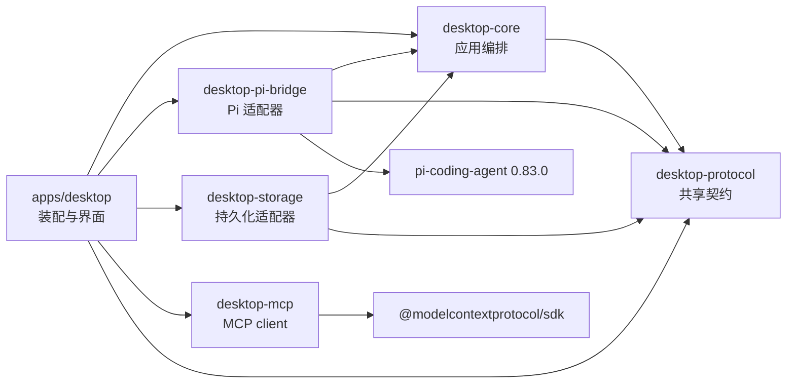
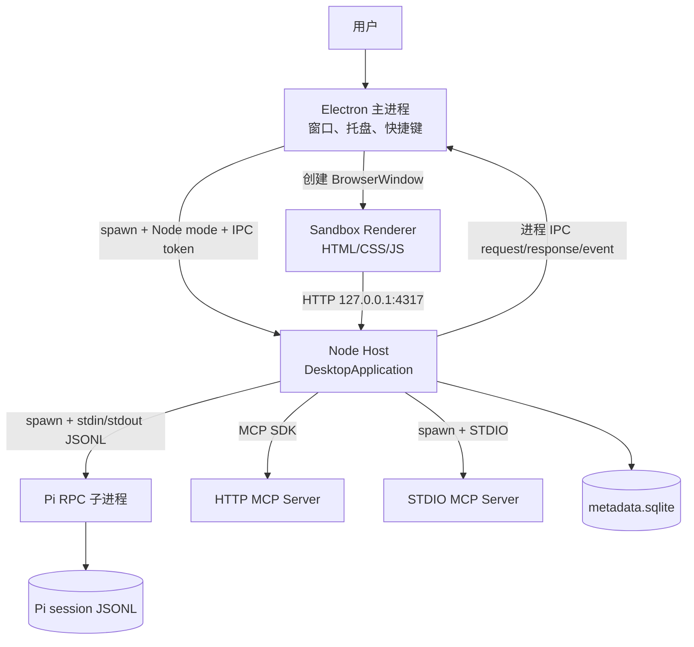
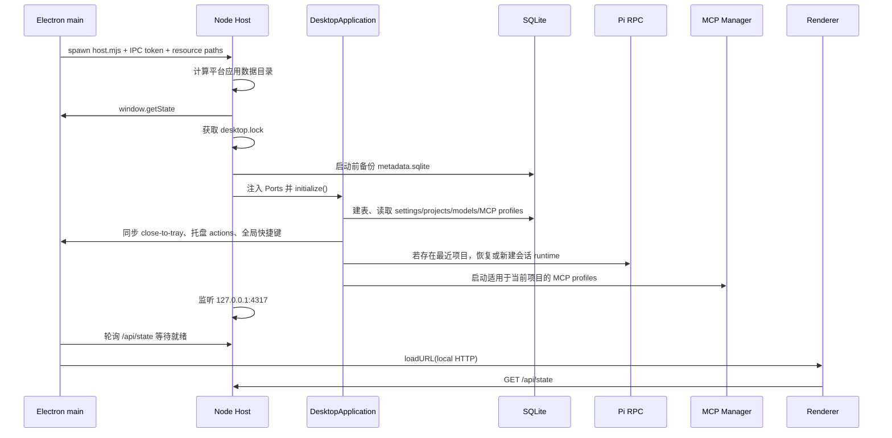
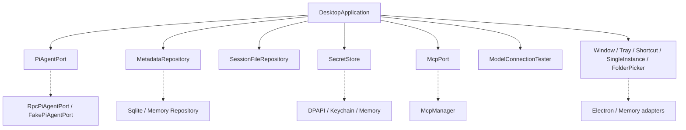
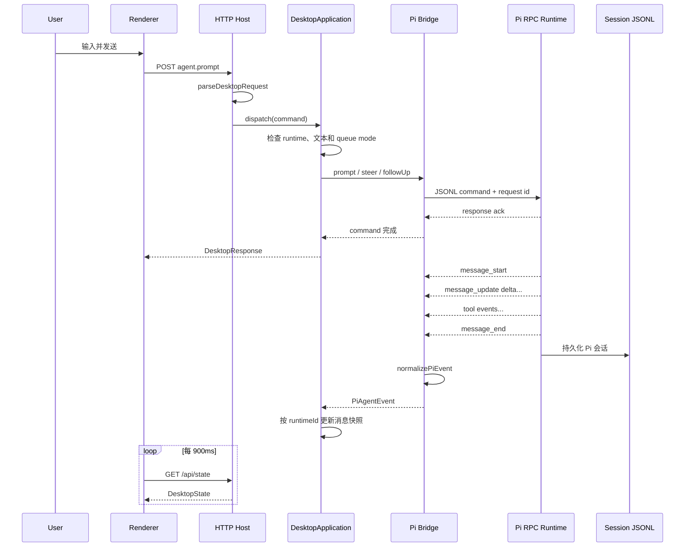
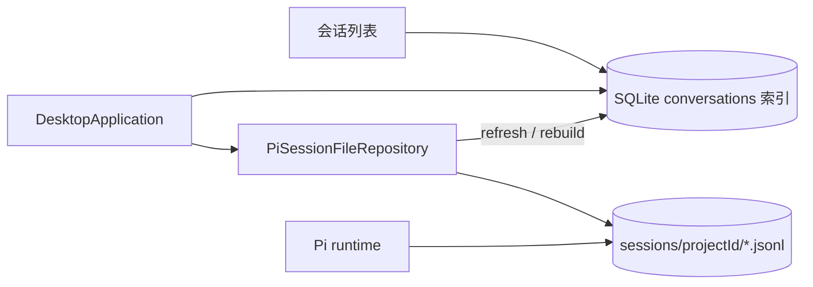
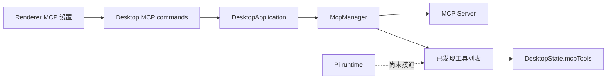
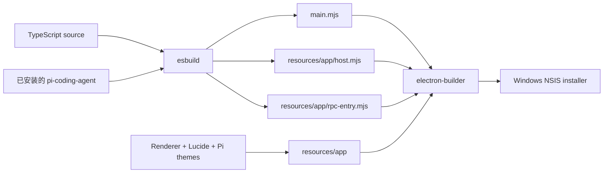
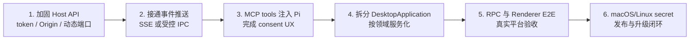

# Pi Desktop 当前实现架构分析

> 本文分析的是 `pi-desktop` 仓库当前 `main` 分支代码，而不是理想方案或上游 Pi CLI 的源码结构。仓库版本为 `0.1.0`，Pi runtime 固定依赖 `@earendil-works/pi-coding-agent@0.83.0`。

## 1. 先建立一个整体认识

Pi Desktop 不是“把 Pi CLI 源码搬进 Electron”，而是一个独立的桌面应用：

- Electron 负责原生窗口、托盘、全局快捷键和应用单实例。
- Node Host 负责应用业务、HTTP API、数据持久化、凭据和子进程管理。
- Pi 继续作为独立子进程运行，通过 stdin/stdout 上的 JSONL RPC 接受命令、推送事件。
- Renderer 只访问本机 HTTP API，不直接接触 Node、文件系统、数据库、API key 或 Pi 内部类型。
- MCP 是 Host 内的独立子系统，可连接和发现工具，但当前还没有真正注入 Pi runtime。

可以把它类比成一个前端熟悉的分层应用：

| 桌面端概念 | 前端类比 | 当前实现 |
| --- | --- | --- |
| Renderer | 浏览器 SPA | 原生 HTML/CSS/JavaScript |
| Desktop Protocol | 前后端共享 DTO/API schema | TypeScript 命令、事件、实体、错误码 |
| Desktop Core | service/store/use-case 层 | `DesktopApplication` |
| Ports | service 接口、依赖注入接口 | Window、Pi、Repository、Secret 等接口 |
| Adapters | API client、持久化实现 | Electron、Pi RPC、SQLite、MCP |
| Pi runtime | 独立后端服务 | `pi-coding-agent` JSONL RPC 子进程 |

一句话概括当前架构：

> **Renderer 发出稳定的 DesktopCommand，DesktopApplication 编排各类 Port，适配器再把意图翻译成 Electron IPC、Pi JSONL RPC、SQLite 或 MCP 调用。**

## 2. 仓库结构与职责

```text
pi-desktop/
├── apps/
│   └── desktop/
│       ├── src/electron/       # 打包后的 Electron 主进程
│       ├── src/host/           # Node Host、HTTP API、平台适配器与装配根
│       ├── src/renderer/       # 浏览器界面，原生 HTML/CSS/JS
│       ├── src/shared/         # Electron <-> Host 私有 IPC 契约
│       └── scripts/            # Windows 安装包、sidecar、manifest、发布检查
├── packages/
│   ├── desktop-protocol/       # 跨层共享的命令、事件、实体、错误和入站校验
│   ├── desktop-core/           # 平台无关的应用编排和 Port 接口
│   ├── desktop-pi-bridge/      # Pi JSONL RPC 客户端、归一化和崩溃恢复
│   ├── desktop-storage/        # SQLite 元数据与 Pi JSONL 会话索引
│   └── desktop-mcp/            # MCP STDIO/HTTP client、策略和工具转换
└── doc/                        # 产品需求、历史方案、Pi 说明和本文
```

各 workspace 的实际依赖方向如下：



这个依赖图体现了明显的 Ports and Adapters（六边形架构）思想：`desktop-core` 定义业务所需能力，外层 package 实现这些能力。Core 不 import Electron、SQLite、MCP SDK 或 Pi 的内部实现，因此可用内存 Port 和 Fake Pi 做快速测试。

需要注意一个不完全对称之处：`desktop-mcp` 自己定义了一套 MCP 类型，而 `desktop-protocol` 也有结构相同的公开 MCP 类型。当前依赖 TypeScript 的结构类型兼容完成装配，长期看存在两套定义漂移的风险。

## 3. 运行时进程模型

### 3.1 安装包模式

打包后的应用至少涉及三个长期角色，启用 STDIO MCP 后还会产生更多子进程：



Electron 主进程通过自身可执行文件加 `ELECTRON_RUN_AS_NODE=1` 拉起 `host.mjs`。Host 再拉起打包好的 `rpc-entry.mjs`。这使原生 Shell、应用业务和 Agent runtime 的崩溃边界彼此分离。

进程间有两套不同的协议：

1. **Electron 与 Host**：Node child-process IPC，消息携带启动时生成的随机 token，并使用请求 id 和 5 秒超时。
2. **Host 与 Pi**：严格以 LF 分隔的 JSONL，命令携带 id，响应通过 pending map 关联，默认 30 秒超时；Agent 事件异步到达。

Renderer 与 Host 之间不是 Electron preload IPC，而是 loopback HTTP：

- `GET /api/state` 获取完整快照。
- `POST /api/command` 提交 `{ requestId, command }`。
- 其他 GET 请求用于静态 Renderer 和 Lucide 模块资源。

### 3.2 开发模式

`npm run dev --workspace=@earendil-works/pi-desktop` 只启动 Node Host，不启动 Electron。此时 Electron 相关 Port 自动退回内存实现，开发者在浏览器打开 `http://127.0.0.1:4317` 调试主业务链路。

这是一种很实用的渐进策略：大部分业务可以像普通 Web 应用一样调试，只有窗口、托盘、快捷键等能力需要 Electron 集成测试或安装包验证。

## 4. 启动与装配流程

Host 的 composition root 位于 `apps/desktop/src/host/main.ts`。它决定“每个接口最终使用哪个实现”。



应用初始化顺序有几个重要设计点：

- 先恢复设置，再把 `closeToTray` 和快捷键同步给原生 Shell。
- 项目按更新时间倒序读取，自动选择最近项目。
- 选中项目时自动加载会话索引；有历史就打开最新会话，没有就创建会话。
- 全局只有一个活动 Pi runtime。切项目会停止旧进程，切同项目会话则复用进程并执行 `switch_session`。
- SQLite 数据库存在时，每次 Host 启动都先做一个最多保留 5 份的备份。

## 5. Desktop Core：架构中心

`packages/desktop-core/src/application.ts` 中的 `DesktopApplication` 是当前系统真正的业务中心。它同时承担：

- 初始化与资源清理；
- 项目、信任状态和当前项目选择；
- 会话创建、打开、重命名、刷新与索引重建；
- Pi runtime 启停、切换、模型和 thinking level；
- prompt、steer、follow-up、abort、retry；
- 模型配置、凭据引用和连接测试；
- 全局设置、Skill 目录和命令列表；
- MCP profile 生命周期；
- 内存快照、事件和最近 100 条诊断。

### 5.1 为什么 Port 很关键

Core 只依赖接口，不依赖具体平台：



这样做带来三个直接收益：

1. Core 单测不需要启动 Electron、数据库或真实模型。
2. Electron 可被别的桌面壳替换，业务命令无需重写。
3. Pi RPC 协议变化被限制在 bridge package，不污染 Renderer 和领域模型。

当前代价是 `DesktopApplication` 已达到约 1176 行，多个领域的状态和用例集中在一个类中。对于 0.1 阶段这能保持调用链直观；继续扩展后，应按 Project/Session、Runtime、Settings/Model、MCP 等应用服务拆分，但仍保留统一装配层。

### 5.2 命令分发

Renderer 不调用 Core 的私有方法，而是发送 `DesktopCommand`。Host 先用 `parseDesktopRequest()` 做运行时校验，再由 `DesktopApplication.dispatch()` 统一执行和映射错误。

命令大致分为：

| 领域 | 代表命令 |
| --- | --- |
| Window/App | `window.show`、`window.minimize`、`app.quit`、`app.getState` |
| Project | `projects.addFromFolder`、`projects.select`、`projects.setTrust` |
| Session | `sessions.create`、`sessions.open`、`sessions.rebuild` |
| Agent | `agent.prompt`、`agent.abort`、`agent.setModel`、`agent.setThinkingLevel` |
| Settings/Model | `settings.update`、`models.create`、`models.testConnection` |
| Skills | `skills.list`、`skills.reload` |
| MCP | `mcp.create`、`mcp.setEnabled`、`mcp.testConnection`、`mcp.listTools` |

所有失败都转换为稳定的 `DesktopErrorCode`，例如 `INVALID_ARGUMENT`、`NOT_FOUND`、`CONFLICT`、`NOT_READY`、`PROCESS_ERROR` 和 `TIMEOUT`。Renderer 因而不需要理解 SQLite、Electron 或 Pi 的底层异常。

### 5.3 状态与事件

`DesktopState` 是 Renderer 使用的完整快照，包含项目、会话、runtime、消息、模型、Skill 命令、MCP、设置和诊断。

Core 同时定义了细粒度 `DesktopEvent`，Pi 事件带 `projectId + sessionId + runtimeId`。`DesktopApplication` 会丢弃 runtimeId 不匹配的旧进程事件，避免切项目或重启后旧流污染新页面。

不过当前 Host 没有把 `DesktopEvent` 传到 Renderer，Renderer 实际每 900ms 拉取一次 `/api/state`。因此现在的事件总线主要用于 Core 内部边界和测试，尚未形成 SSE/WebSocket/IPC 推送链路。

## 6. 一次对话如何流转



输入队列遵守 Pi 的三种语义：

- runtime 空闲时只能使用 `prompt`；
- streaming 时必须显式选 `steer` 或 `followUp`；
- `steer` 尽快影响当前任务，`followUp` 等当前任务完成后再处理；
- `abort` 终止当前生成，不删除已经写入的会话；
- 首条用户输入会自动替换 `New conversation`，截断为最多 72 个字符的会话名。

当前 Renderer 通过轮询获取流式增量，因此显示粒度受 900ms 周期限制。Core 和 Bridge 已保留逐 delta 事件，为后续改成 SSE/WebSocket 提供了基础。

## 7. Pi Bridge：隔离上游 runtime

### 7.1 启动参数与模型注入

`RpcPiAgentPort.start()` 会：

1. 创建 agent 和 session 目录；
2. 根据桌面模型配置生成 `agent/models.json`；
3. API key 不写入该 JSON，而是使用环境变量占位符，并只注入 Pi 子进程环境；
4. 拼接 `--session-dir`、`--session`、`--append-system-prompt`、`--skill`、`--provider`、`--model`；
5. 根据项目 trust 映射为 `--approve` 或 `--no-approve`；
6. 启动后依次执行 `get_state`、`get_messages` 和 `get_commands`；
7. 完成握手后才报告 ready。

当前自定义模型统一生成成 `openai-completions` provider，并标记 `reasoning: true`。这意味着桌面模型配置目前是“OpenAI 兼容 endpoint”抽象，不是任意 Pi provider 的完整配置 UI。

### 7.2 JSONL 协议处理

Bridge 没使用通用逐行工具，而是维护 UTF-8 decoder 和缓冲区，只以 `\n` 为边界。这可以避免字符串中的 Unicode 行分隔符被误切分。

每条命令分配 `desktop_<uuid>`：

- 响应到达后从 pending map 找回 Promise；
- 30 秒没有响应则返回 `TIMEOUT`；
- stdin 写失败、进程退出或主动 stop 会 reject 所有 pending 请求；
- stderr 只保留末尾约 8000 字符，并用已知 API key 的精确值做脱敏；
- Pi 原始消息、state、command 和 event 会被转换为桌面自有类型。

### 7.3 崩溃恢复

`RecoveringPiAgentPort` 包装真实 Port：

- 记住最近 `PiRuntimeOptions` 和 session path；
- 进程报错后最多尝试 3 次；
- 延迟按 500ms、1000ms、2000ms 指数退避；
- 使用相同 runtimeId 恢复，Core 可继续关联同一活动 runtime；
- 主动停止时禁止自动重启。

需要注意：恢复是进程级重启，不是事务回滚。能恢复到哪里取决于 Pi 已经写入 JSONL 的会话状态。

## 8. 项目、会话与持久化

### 8.1 两个事实源

项目采用“双层存储，但职责不重复”的设计：

| 数据 | 事实源 | 内容 |
| --- | --- | --- |
| 应用元数据 | SQLite | 项目、会话索引、模型 profile、设置、MCP profile |
| 完整对话 | Pi JSONL | 消息、工具调用、模型/思考级别变化、session info 和叶节点 |
| API key | OS Secret Store | 明文凭据；SQLite 只保存 `credentialRef` |



JSONL 是对话内容的事实源，SQLite 只为桌面查询和排序保存可重建索引。启动项目、手动 refresh 或 rebuild 时，会话扫描器会解析：

- session header 的 id 和创建时间；
- `session_info` 的名称；
- 首条用户消息作为缺省标题；
- `model_change` 和 assistant 消息中的模型；
- `thinking_level_change`；
- 最后 entry id 作为 leafId。

损坏的单个 JSONL 不会让整个扫描失败，而是进入诊断列表，其余有效会话继续显示。

### 8.2 SQLite 设计

SQLite 使用 Node 22 内置的 `node:sqlite` 同步 API，并启用：

- foreign keys；
- WAL；
- 5 秒 busy timeout；
- migration transaction。

目前 schema version 为 1，表包括 `schema_migrations`、`projects`、`conversations`、`model_profiles`、`app_settings` 和 `mcp_servers`。删除项目会通过外键级联删除会话**索引**，但不会删除对应 Pi JSONL 文件，这符合“移除桌面关联不等于销毁用户对话数据”的保守策略。

### 8.3 应用数据目录

生产 Host 将数据集中放在平台标准目录：

```text
Pi Desktop data directory/
├── metadata.sqlite              # 应用元数据
├── backups/                     # 启动前数据库备份，最多 5 份
├── desktop.lock                 # Host 进程锁
├── agent/
│   └── models.json              # 当前 runtime 的 Pi 模型配置
├── sessions/<projectId>/*.jsonl # Pi 完整会话
├── diagnostics/*.json           # 手动导出的脱敏诊断
└── secrets.json                 # Windows 上 DPAPI 密文映射
```

Windows 使用 `%LOCALAPPDATA%/Pi Desktop`，macOS 使用 `~/Library/Application Support/Pi Desktop`，Linux 使用 `$XDG_DATA_HOME/pi-desktop` 或 `~/.local/share/pi-desktop`。

## 9. 模型、凭据与 Skills

### 9.1 模型

模型 profile 保存 providerId、modelId、显示名、baseUrl、enabled 和 credentialRef。Core 会校验：

- provider id 格式；
- model id 和显示名非空；
- base URL 只能是 HTTP/HTTPS，不能包含账号、密码、query 或 fragment；
- providerId + modelId 不重复。

连接测试固定请求 `<baseUrl>/models`，超时 10 秒。因此它适合 OpenAI 兼容服务，但不能证明一次真实 completion 一定成功。

### 9.2 凭据

- Windows：PowerShell 调用 CurrentUser 范围 DPAPI，加密值写入 `secrets.json`。
- macOS：使用系统 `security` 命令读写 Keychain。
- Linux：当前退回 `MemorySecretStore`，重启后凭据消失，持久化 profile 会留下失效引用。

API 返回只包含 credentialRef，不返回明文。Pi stderr 会替换本次 runtime 已知的 API key；诊断导出还会按常见 secret 字段名再次脱敏。

### 9.3 Skills

桌面端不解析 Skill 文件。它把配置的 skill 路径作为 `--skill` 参数交给 Pi，再通过 `get_commands` 获取 Pi 已发现的命令。Renderer 的 `/` 菜单只是对这份命令列表做筛选和选择。

修改 Skill 目录或点击 reload 会重启当前 Pi runtime，然后重新查询命令。这保证资源加载逻辑仍由 Pi 负责，但重启期间当前生成会被停止。

## 10. MCP 子系统：已实现部分与关键缺口

### 10.1 已实现

`desktop-mcp` 已经具备一个相对完整的 Host 侧 client：

- 基于官方 SDK 支持 STDIO 和 Streamable HTTP；
- 初始化、工具发现、工具调用和关闭；
- server namespace 与工具名冲突检查；
- 全局或 projectId 作用域；
- 单 server 超时（100ms 到 300000ms）；
- 最大输出限制（1KB 到 10MB）；
- HTTP Bearer secret 或 STDIO `PI_MCP_SECRET` 注入；
- 项目信任或显式 consent 门禁；
- server/tool 生命周期事件；
- profile 启停、连接测试和错误快照。

### 10.2 当前实际调用链



仓库中已经存在 `createPiMcpTools()`，可以把 MCP tool 转换为 Pi 风格的 tool definition；但它没有被任何装配代码引用，`PiRuntimeOptions` 也没有接收 MCP tools。因此当前 0.1 实现只能在设置页配置、连接、测试和查看 MCP server/tool，**模型无法在对话中调用 MCP 工具**。

此外还有几项尚未闭环：

- Host 把 consent 回调硬编码为 `false`，UI 没有授权交互；
- MCP credentialRef 有底层读取能力，但 Renderer 没有保存 MCP secret 的入口；
- `McpManager` 的事件未映射为 Core 的 `mcp.serverChanged` / `mcp.toolsChanged`；
- connection test 会临时 start 后 stop，应用快照没有同步这次停止状态；
- Renderer 表单暂未暴露 env、project scope、timeout、output limit 等完整配置。

因此 MCP 应被描述为“Host client 和配置骨架已落地，Agent 集成尚未完成”，而不是已完成的 Agent 能力。

## 11. Renderer 与桌面 Shell

### 11.1 Renderer

当前 UI 没有 React、Vue 或状态库。`app.js` 维护一个 `desktopState`，用模板字符串整体更新主要区域，并通过 document 级事件委托处理交互。

已覆盖的主界面能力包括：

- 项目与会话树、创建和重命名；
- trust banner；
- 消息、thinking 和 tool part 展示；
- 模型与 thinking level 选择；
- prompt、steer、follow-up、abort、retry、复制；
- `/` 命令菜单；
- 模型、全局设置、Skills、MCP 和诊断页。

它的优点是依赖少、验证纵向链路快；限制是：

- 每 900ms 拉完整 state，项目/消息多后传输和整页重绘成本会上升；
- 真实 delta 不能立即显示；
- 视图状态只在 Renderer 内存中，例如托盘的 Settings action 当前只唤起窗口，不会自动切到设置页；
- 没有前端自动化/E2E 测试，Renderer 行为主要靠人工验证。

### 11.2 Electron Shell

Electron 只承担必须使用原生 API 的职责：

- `BrowserWindow`；
- 系统托盘和菜单；
- 全局快捷键；
- Electron 单实例锁；
- 外部 HTTPS 链接；
- Host 子进程生命周期。

BrowserWindow 设置了 `nodeIntegration: false`、`contextIsolation: true`、`sandbox: true`，且没有 preload 暴露 Node API。Renderer 因此是真正的低权限浏览器上下文。

Electron 和 Host 之间的 `ElectronShellBridge` 把原生能力重新实现成 Core Port；开发模式下则换成 Memory Port。这一层是桌面壳可替换性的关键。

## 12. 安全边界

当前已经落实的安全措施：

- Renderer 无 Node/fs 能力，Electron sandbox 开启；
- Host HTTP 只监听 `127.0.0.1`；
- 静态资源路径经过 normalize + relative 检查，阻止越出资源目录；
- Electron 与 Host 的私有 IPC 使用随机 token 和消息 schema；
- 入站 DesktopCommand 做运行时结构校验；
- 项目路径 canonicalize，避免同一路径以不同写法重复注册；
- 项目 trust 映射到 Pi 的 approve/no-approve 启动策略；
- API key 与普通 SQLite 分离；
- MCP 工具有 trust/consent、超时、取消和输出大小门禁；
- 诊断导出和 Pi stderr 都有脱敏处理。

仍需重点处理的边界：

1. **Loopback HTTP 没有认证**：随机 host token 只保护 Electron/Host IPC，没有保护 `/api/command`。本机其他进程或浏览器页面理论上可尝试访问端口；还缺少 token、Origin 校验或改用受控 Electron IPC。
2. **HTTP 端口固定**：安装包硬编码 4317，端口被占用时 Host 会失败，Electron 只会显示启动失败页。
3. **Settings patch 校验偏宽**：`settings.update.patch` 只要求是 object，细分字段和未知字段没有在 protocol 层完整拒绝。
4. **凭据仍进入子进程环境**：没有写入 models.json，但同一用户权限下的进程环境仍是需要接受和记录的威胁模型。
5. **MCP env 持久化**：profile.env 原样保存到 SQLite，只应放非敏感变量；敏感值必须走 credentialRef。
6. **Linux secret 不持久化**：需要 Secret Service/libsecret 等正式实现后才能达到 Windows/macOS 同级能力。
7. **信任语义依赖 Pi 参数**：桌面端本身只选择 `--approve` 或 `--no-approve`，项目资源发现和执行的最终边界仍由所固定版本的 Pi runtime 决定。

## 13. 打包与发布架构

Windows 打包脚本使用 esbuild 和 electron-builder：



项目不会读取旁边的 Pi 源码仓库。升级 Pi 的唯一正式入口是修改 `packages/desktop-pi-bridge/package.json` 中的精确版本，然后更新 lockfile、跑检查和 RPC smoke test。

当前发布配置与 `release-manifest.json` 之间还存在成熟度差异：manifest 声明 Windows MSI/NSIS 和 macOS DMG/App、签名、notarization、原子升级与回滚目标，但实际落地脚本只构建 Windows x64 NSIS，且构建时关闭证书自动发现。manifest 更接近发布契约/目标，不代表所有目标已经实现。

## 14. 当前完成度

| 能力 | 状态 | 依据或限制 |
| --- | --- | --- |
| Electron 窗口、托盘、快捷键 | 已实现 | Electron/Host IPC adapter 已有测试 |
| 浏览器开发模式 | 已实现 | Memory shell ports + loopback HTTP |
| 项目与会话 | 已实现主链路 | SQLite 索引 + Pi JSONL；缺少导出/树形分支 UI |
| Pi RPC 对话 | 已实现主链路 | prompt/stream/abort/switch session/model/thinking |
| 崩溃恢复 | 基础实现 | 最多 3 次指数退避；缺少更完整的用户恢复 UX |
| OpenAI 兼容模型 | 已实现基础配置 | 统一 `openai-completions`，连接测试仅 `/models` |
| Skills | 已实现基础接入 | 由 Pi 发现，支持额外目录和 slash 菜单 |
| MCP client | 已实现 | STDIO/HTTP、发现、调用、策略有单测 |
| MCP 给 Agent 使用 | **未实现** | `createPiMcpTools()` 未装配到 Pi runtime |
| 凭据 | Windows/macOS 基础实现 | Linux 仅内存；MCP secret UI 未闭环 |
| 实时 UI 事件 | 未实现 | Core 有事件，Renderer 仍轮询快照 |
| Windows 安装包 | 基础实现 | NSIS x64；正式签名/升级验收未闭环 |
| macOS 发布 | 未实现 | manifest 有目标，缺少实际构建脚本和验收 |
| 自动化测试 | 有核心单元/集成测试 | 缺 RPC 进程集成、Renderer E2E 和平台安装测试 |

## 15. 设计评价与演进建议

### 15.1 值得保留的设计

1. **Pi 是外部 runtime，不复制 Agent loop**：桌面仓库只固定一个发布版本，升级边界清楚。
2. **Core 与适配器分离**：业务不会被 Electron、SQLite 或 Pi RPC 锁死。
3. **JSONL 与 SQLite 各司其职**：完整对话不重复写两份，索引又能重建。
4. **单活动 runtime**：先避免多项目并发、会话锁和资源竞争，适合首版。
5. **稳定 Desktop Protocol**：隔离上游 Pi 事件和底层错误，给 UI 留出长期契约。
6. **开发模式可脱离 Electron**：缩短绝大多数业务迭代的反馈周期。
7. **把安全放在 Host**：凭据、信任、MCP 策略不交给 Renderer。

### 15.2 建议的优先演进顺序



优先级理由：Host API 是当前权限边界；事件推送直接改善流式体验并减少全量快照；MCP 注入是产品能力缺口；Core 拆分应在功能边界稳定后进行，避免过早抽象。

## 16. 测试现状

现有测试覆盖：

- `desktop-protocol`：合法/非法命令 schema；
- `desktop-core`：Fake Pi 流式链路、快捷键冲突回滚、close-to-tray；
- `desktop-pi-bridge`：严格 LF JSONL framing；
- `desktop-storage`：SQLite 重开持久化、JSONL 会话重建和坏文件隔离；
- `desktop-mcp`：fake STDIO server 的发现/调用和 profile 校验；
- `apps/desktop`：Electron Shell bridge 的请求、状态和事件转发。

明显缺口：

- `RpcPiAgentPort` 的真实/伪 RPC 子进程集成测试；
- timeout、崩溃恢复、事件归一化的系统覆盖；
- HTTP API 鉴权和输入边界测试；
- Renderer 交互与流式 E2E；
- Electron 冷启动、端口冲突、托盘、安装/卸载与签名测试；
- MCP 到 Pi tool call 的端到端测试（因为链路尚未接通）。

## 17. 推荐源码阅读顺序

如果从前端背景开始理解本项目，建议沿“一次用户操作如何到达 Pi”阅读：

1. `apps/desktop/src/renderer/app.js`：先看 UI 发出了哪些命令、消费什么 state。
2. `packages/desktop-protocol/src/commands.ts` 与 `types.ts`：理解前后端契约。
3. `apps/desktop/src/host/main.ts`：看所有实现如何组装，以及 HTTP 边界。
4. `packages/desktop-core/src/application.ts`：看命令如何成为业务动作。
5. `packages/desktop-core/src/ports.ts`：理解 Core 对外部世界的依赖。
6. `packages/desktop-pi-bridge/src/rpc-port.ts`：跟踪 prompt 如何变成 JSONL。
7. `packages/desktop-pi-bridge/src/normalize.ts`：看 Pi 原始事件如何变成桌面消息。
8. `packages/desktop-storage/src/sqlite-repository.ts` 和 `session-files.ts`：理解双层存储。
9. `apps/desktop/src/electron/main.ts` 与 `host/electron-ports.ts`：最后看原生壳和跨进程 IPC。
10. `packages/desktop-mcp/src/manager.ts`：独立理解 MCP 生命周期和未完成的接入点。

## 18. 关键源码索引

| 主题 | 源码 |
| --- | --- |
| Host 装配与 HTTP API | [`apps/desktop/src/host/main.ts`](../apps/desktop/src/host/main.ts) |
| Electron 主进程 | [`apps/desktop/src/electron/main.ts`](../apps/desktop/src/electron/main.ts) |
| Electron/Host IPC | [`apps/desktop/src/host/electron-ports.ts`](../apps/desktop/src/host/electron-ports.ts)、[`apps/desktop/src/shared/electron-shell-ipc.ts`](../apps/desktop/src/shared/electron-shell-ipc.ts) |
| Renderer | [`apps/desktop/src/renderer/app.js`](../apps/desktop/src/renderer/app.js) |
| 应用核心 | [`packages/desktop-core/src/application.ts`](../packages/desktop-core/src/application.ts) |
| Port 接口 | [`packages/desktop-core/src/ports.ts`](../packages/desktop-core/src/ports.ts) |
| Desktop 契约 | [`packages/desktop-protocol/src/commands.ts`](../packages/desktop-protocol/src/commands.ts)、[`schema.ts`](../packages/desktop-protocol/src/schema.ts)、[`events.ts`](../packages/desktop-protocol/src/events.ts) |
| Pi RPC | [`packages/desktop-pi-bridge/src/rpc-port.ts`](../packages/desktop-pi-bridge/src/rpc-port.ts) |
| 恢复与归一化 | [`packages/desktop-pi-bridge/src/recovering-port.ts`](../packages/desktop-pi-bridge/src/recovering-port.ts)、[`normalize.ts`](../packages/desktop-pi-bridge/src/normalize.ts) |
| SQLite/JSONL | [`packages/desktop-storage/src/sqlite-repository.ts`](../packages/desktop-storage/src/sqlite-repository.ts)、[`session-files.ts`](../packages/desktop-storage/src/session-files.ts) |
| MCP | [`packages/desktop-mcp/src/manager.ts`](../packages/desktop-mcp/src/manager.ts)、[`transport.ts`](../packages/desktop-mcp/src/transport.ts)、[`pi-bridge.ts`](../packages/desktop-mcp/src/pi-bridge.ts) |
| 凭据与平台服务 | [`apps/desktop/src/host/platform-services.ts`](../apps/desktop/src/host/platform-services.ts) |
| Windows 打包 | [`apps/desktop/scripts/build-windows-installer.mjs`](../apps/desktop/scripts/build-windows-installer.mjs) |

## 19. 总结

Pi Desktop 当前已经不是单纯的架构骨架：项目/会话、真实 Pi RPC、模型与 Skills、SQLite、Electron 原生能力、凭据、MCP client 和 Windows 打包链路都已有代码。不过它仍处于“纵向功能打通、产品化尚未闭环”的阶段。

理解这个项目最重要的不是记住每个类，而是抓住三条边界：

1. **Renderer 只懂 Desktop Protocol，不懂 Pi 和操作系统。**
2. **DesktopApplication 只做业务编排，通过 Ports 使用外部能力。**
3. **Pi JSONL 是对话事实源，SQLite 是桌面索引，Pi runtime 是独立进程。**

在这三条边界不被破坏的前提下，后续可以逐步替换 Renderer、增强实时 IPC、接通 MCP、拆分 Core，并完善跨平台发布，而无需重写 Agent 内核。
