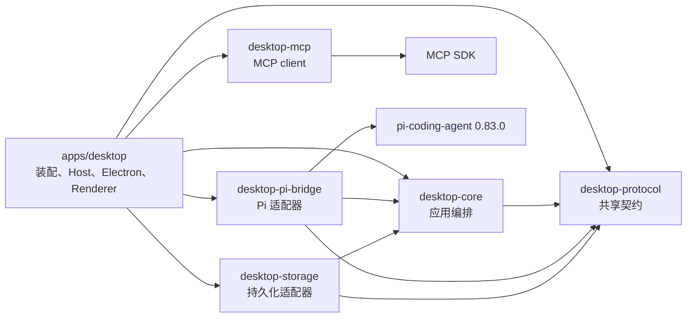
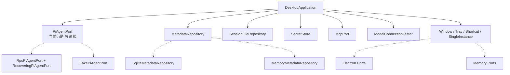
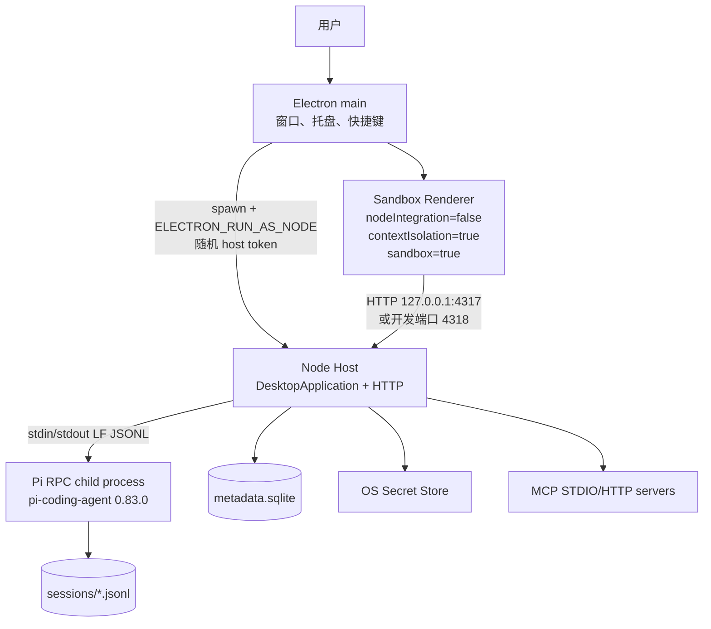
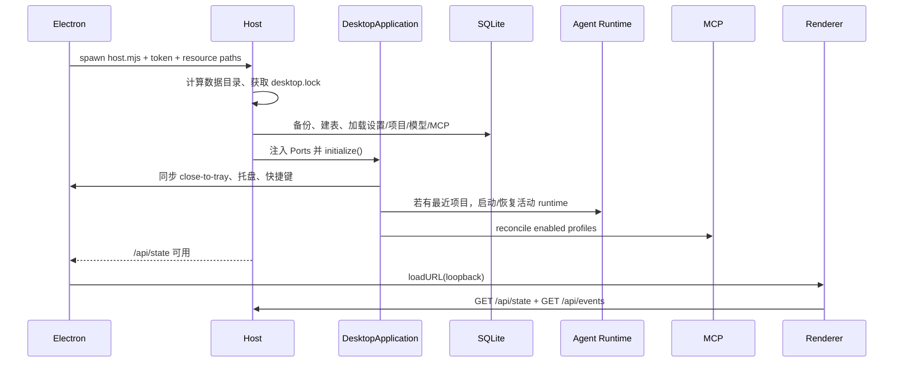
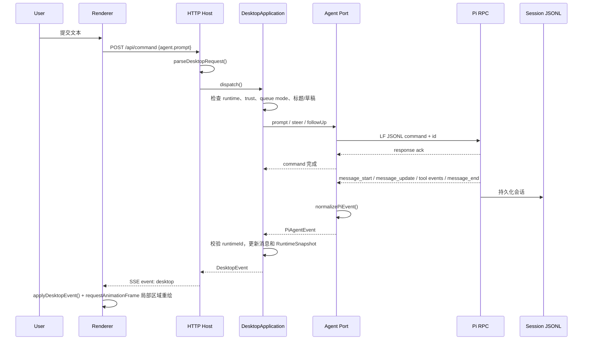
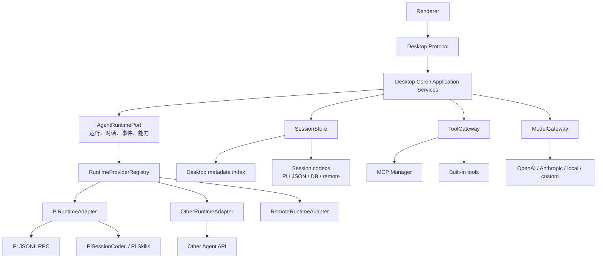
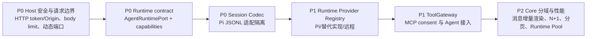

# Pi Desktop 当前架构与可插拔改造分析

> 分析基线：`main` 分支提交 `f57906c`，2026-08-02。本文以当前仓库代码为准，历史规划文档只用于解释设计意图，不把尚未落地的目标当成现状。

## 0. 结论先行

Pi Desktop 当前是一个 **Electron 原生壳 + Node Host + 独立 Pi RPC 子进程 + 本地 SQLite/JSONL 存储** 的桌面 Agent。它已经形成了清晰的端口/适配器骨架：Renderer 只懂 Desktop Protocol，`DesktopApplication` 负责业务编排，Electron、SQLite、凭据、MCP 和 Pi 都在外层实现。

但“底层 Agent 可替换”目前只完成了接口层的一半：

- **可以较低成本替换**：在 `apps/desktop/src/host/main.ts` 换掉注入的 `PiAgentPort` 实现，或实现一个兼容当前 `PiAgentPort` 的新适配器；Renderer、HTTP API 和大部分 Core 用例可以保持不动。
- **不能无痛替换**：当前 `PiAgentPort` 的命名和数据结构仍然是 Pi 形状；`RpcPiAgentPort` 直接依赖 Pi 0.83.0 的 `rpc-entry`、CLI 参数、JSONL 命令和事件；`desktop-storage` 直接解析 Pi session JSONL；Skills、Extension 和模型配置也通过 Pi 启动参数注入。
- **因此替换成本取决于目标**：只替换 Agent 生成运行时是“中等成本”；同时保留旧会话、Skills、MCP 工具和所有 Pi 特性，则需要增加 Runtime Adapter、Session Codec、Capability Negotiation 和 Tool Gateway。

最值得保留的三条边界是：

1. Renderer 不直接接触 Node、文件、SQLite、API key 或 Pi 类型。
2. Core 通过 Port 编排外部能力，而不是在 Electron 主进程里写业务。
3. 完整会话内容仍以运行时会话文件为事实源，SQLite 只保存可重建的桌面索引。

最需要优先修复的三件事是：

1. 把 `PiAgentPort` 演进为真正的 `AgentRuntimePort`，将 Pi 专属字段和命令翻译移到 Pi Adapter。
2. 将 Pi session JSONL 解析改为 `SessionStore + SessionCodec`，为其他运行时保留独立格式和导入能力。
3. 把 MCP 工具接入统一的 `ToolGateway`，同时补齐 consent、事件和 UI 闭环。

## 1. 项目基线与技术栈

### 1.1 仓库性质

仓库是独立的 npm workspace monorepo，不包含 Pi 源码树。Pi 通过精确版本依赖引入：

```text
packages/desktop-pi-bridge/package.json
  @earendil-works/pi-coding-agent: 0.83.0
```

升级 Pi 的实际入口是该依赖和 lockfile，而不是修改旁边的 Pi checkout。打包脚本使用 `import.meta.resolve("@earendil-works/pi-coding-agent/rpc-entry")` 找到 RPC 入口，并将其打进安装包。

### 1.2 技术栈

| 领域 | 当前实现 | 作用 |
| --- | --- | --- |
| 桌面壳 | Electron `43.2.0` | BrowserWindow、托盘、全局快捷键、单实例、外部链接 |
| Host | Node.js `>=22.19.0`、TypeScript | 应用编排、HTTP、进程管理、凭据、诊断 |
| Renderer | 原生 HTML/CSS/JavaScript、Lucide `1.27.0` | 低依赖桌面工具界面 |
| 跨层契约 | `desktop-protocol` | 命令、事件、状态、实体、错误和手写运行时校验 |
| 应用核心 | `desktop-core` | `DesktopApplication`、Port 接口、业务状态机 |
| Agent 接入 | `desktop-pi-bridge` | Pi RPC 子进程、LF JSONL、事件归一化、崩溃恢复、Fake Port |
| 持久化 | Node `node:sqlite`、Pi session JSONL | 元数据索引与完整会话分工 |
| MCP | 官方 `@modelcontextprotocol/sdk 1.30.0` | STDIO/Streamable HTTP client、工具发现和策略 |
| 凭据 | Windows DPAPI、macOS Keychain、Linux 内存实现 | API key 与 MCP secret 的存取 |
| 打包 | esbuild + electron-builder + NSIS | 当前实际落地 Windows x64 安装包 |

### 1.3 workspace 依赖方向



这是 Ports and Adapters（六边形/依赖倒置）方向：Core 不 import Electron、SQLite、MCP SDK 或 Pi 内部实现。需要注意两处不完全解耦：

- `desktop-core` 的 Port 名称和选项仍然以 Pi 为中心。
- `desktop-mcp` 在自己的包里重复定义了 `McpServerProfile`、`McpServerSnapshot`、`McpTool` 等类型，而 `desktop-protocol` 也定义了一份；目前依靠 TypeScript 结构类型兼容，存在漂移风险。

## 2. 模块职责

### 2.1 `apps/desktop`

- `src/electron/main.ts`：Electron 主进程，创建窗口/托盘、处理窗口生命周期和快捷键，通过受 token 保护的 Node child-process IPC 调用 Host。
- `src/host/main.ts`：composition root。创建数据目录、锁、SQLite、Secret Store、MCP Manager、Pi Port、Renderer HTTP 服务，并把所有实现注入 `DesktopApplication`。
- `src/host/electron-ports.ts`：把 Electron 原生操作实现成 Core 的 `WindowPort`、`TrayPort`、`ShortcutPort`。
- `src/host/platform-services.ts`：DPAPI/Keychain、文件夹选择、模型 `/models` 连接测试。
- `src/renderer/app.js` 与 `styles.css`：原生 UI、命令提交、SSE 事件应用、局部重绘和设置页。
- `scripts/`：开发构建、sidecar、Windows 打包、release manifest 和 preflight。

### 2.2 `desktop-protocol`

定义 `DesktopCommand`、`DesktopResponse`、`DesktopState`、`DesktopEvent`、项目/会话/消息/模型/MCP 实体和稳定错误码。`parseDesktopRequest()` 在 HTTP 入站处做运行时校验，Renderer 不需要理解底层异常。

### 2.3 `desktop-core`

`DesktopApplication` 是当前业务中心，负责：初始化、项目和信任状态、会话生命周期、单活动 Agent runtime、prompt/steer/follow-up/abort/retry、模型和凭据引用、全局设置、Skills、MCP profile、状态快照、事件和诊断。

Core 依赖的关键 Port：



目前是“一个 Application 类承载多个应用域”的实现，源码已超过 1500 行，适合首版纵向打通，但继续增加模型、工具、会话树和多 runtime 后会成为维护瓶颈。

### 2.4 `desktop-pi-bridge`

`RpcPiAgentPort` 做了以下 Pi 专属工作：

1. 解析 Pi 的 ESM `rpc-entry`。
2. 写入 Pi 期望的 `agent/models.json`，并把 API key 通过环境变量占位符注入子进程。
3. 拼接 `--session-dir`、`--session`、`--approve/--no-approve`、`--append-system-prompt`、`--skill`、`--extension`、`--provider`、`--model`。
4. 以 LF 为边界处理 JSONL，按 request id 关联响应，等待 `get_state/get_messages/get_commands` 握手。
5. 把 `message_start/message_update/message_end/tool_execution_*` 等 Pi 事件归一化为桌面自有事件。

`RecoveringPiAgentPort` 是外层监督器：最多 3 次、500/1000/2000ms 退避，用最近 runtime options 和 session path 重启进程。它是进程级恢复，不是事务回滚，也不会重放崩溃前未确认的 prompt。

### 2.5 `desktop-storage`

- SQLite 保存项目、会话索引、模型 profile、设置和 MCP profile。
- Pi JSONL 保存完整消息、session info、模型/思考级别变化和 leaf 信息。
- `PiSessionFileRepository` 扫描和解析 Pi session JSONL；坏文件进入 diagnostics，不阻塞其他文件。
- `metadata.sqlite` 启用 WAL、外键和 busy timeout，Host 启动前最多保留 5 份备份。

这是“JSONL 事实源 + SQLite 可重建索引”的设计，而不是把完整 transcript 重复写入两套存储。

### 2.6 `desktop-mcp`

已实现：STDIO、Streamable HTTP、初始化、工具发现、工具调用、namespace 冲突校验、project scope、trust/consent 门禁、超时、取消、输出上限和 secret 注入。

未闭环：

- `createPiMcpTools()` 只提供转换函数，没有在 `host/main.ts` 或 Pi runtime options 中装配。
- Host 将 consent 固定为 `async () => false`，未提供用户授权交互。
- `DesktopApplication` 没有订阅 `McpManager` 的完整事件并映射到 `mcp.serverChanged/mcp.toolsChanged`。
- Renderer 表单没有完整配置 env、MCP credentialRef、project scope、timeout 和 output limit。

因此 MCP 当前是“Host client 与设置骨架已实现，Agent 工具调用尚未接通”。

## 3. 运行时、启动和数据流

### 3.1 进程模型



Electron 与 Host 之间是 Node IPC，消息包含随机 token、请求 id 和 5 秒超时。Host 与 Pi 之间是独立的 LF JSONL RPC，默认请求超时 30 秒。Renderer 与 Host 之间是 loopback HTTP，不使用 preload API。

开发模式分两种：

- `npm run dev --workspace=@earendil-works/pi-desktop`：直接启动 Host，使用 Memory Shell Ports，浏览器打开 `http://127.0.0.1:4317`。
- `npm run dev:desktop --workspace=@earendil-works/pi-desktop`：`dev-desktop.mjs` 临时构建 Electron/Host/RPC/Extension 和资源，使用 `.pi-dev/desktop-dev`、`.pi-dev/desktop-data`，Electron 监听 4318。

### 3.2 启动序列



### 3.3 一次 prompt 的数据流



当前已不是旧版的固定 900ms 全量轮询：Host 通过 `/api/events` 提供 SSE，Renderer 直接应用消息 delta、工具和 runtime 事件；SSE 断开时每 15 秒全量刷新，用户命令完成后也会触发一次 `/api/state` 刷新。

### 3.4 会话与索引流程

新会话先作为 `draftSession` 保存在内存中，只有 Pi session 文件出现并且产生可见回复后才提升到 SQLite 历史。这解决了 Pi 启动后空 JSONL 被误列为历史的问题。切换项目会停止旧 runtime；同项目切换会话优先复用 runtime 并发送 `switch_session`。

## 4. 设计分析

### 4.1 分层与依赖倒置

当前主线符合以下结构：

```text
Renderer
  -> Desktop Protocol (commands/events/state)
  -> HTTP Host
  -> DesktopApplication (use-case orchestration)
  -> Ports
  -> Electron / Pi RPC / SQLite / Secret / MCP adapters
```

优点：

- Core 单测可以用 Memory Repository、Memory Shell 和 Fake Pi，不需要真实 Electron 或模型 key。
- Renderer 不持有 Node 权限，平台能力集中在 Host。
- Pi 原始事件和错误在 bridge 归一化后才进入桌面状态，减少上游类型扩散。
- Electron 与 Host 分进程，Pi 再独立为子进程，故障边界清晰。

### 4.2 关键设计模式

| 模式 | 当前落点 | 评价 |
| --- | --- | --- |
| Ports and Adapters | `desktop-core/src/ports.ts` + 各 adapter | 是当前可替换性的主要基础 |
| Composition Root | `apps/desktop/src/host/main.ts` | 装配集中，便于切换实现；目前仍硬编码 Pi adapter |
| Anti-Corruption Layer | `desktop-pi-bridge/normalize.ts` | 隔离 Pi 事件/状态，但 Port 名称仍带 Pi 语义 |
| Request/Response Correlation | Pi pending map、Electron shell bridge | 防止并发响应错配；超时和退出会 reject pending |
| Supervisor/Recovery | `RecoveringPiAgentPort` | 有限退避重启；无消息重放和恢复 UX |
| Event Bus + Snapshot | Core `subscribe` + `DesktopEvent` + `/api/events` | 流式链路已打通；部分领域事件仍未闭环 |
| Rebuildable Index | SQLite + session JSONL scan/rebuild | 数据职责清楚；扫描成本随历史增长 |

### 4.3 安全边界

已落实：Renderer sandbox、loopback 监听、静态路径穿越检查、Electron/Host token、命令运行时校验、项目路径 canonicalize、trust 映射、凭据隔离、MCP 超时/输出限制和诊断脱敏。

仍然存在的边界：

1. `/api/state`、`/api/events`、`/api/command` 没有 Host token 或 Origin 鉴权；同一用户下的其他进程理论上可以访问固定端口。
2. `readJson()` 没有请求体大小上限；畸形或超大 JSON 会占用 Host 内存/CPU。
3. secret 最终仍需进入 Agent 子进程环境；同用户权限下的进程可观测性需要纳入威胁模型。
4. MCP `profile.env` 以普通 JSON 保存，敏感变量应改为 credentialRef。
5. Linux 使用 `MemorySecretStore`，重启后模型/MCP credentialRef 会失效。
6. Host 统一把异常返回 HTTP 400，无法区分输入错误、未就绪、冲突和内部故障。

## 5. 当前问题识别

### 5.1 耦合问题：桌面层与 Pi 的实际关系

#### 直接耦合点

| 位置 | 当前耦合 | 影响 |
| --- | --- | --- |
| `desktop-pi-bridge/package.json` | 精确锁定 `@earendil-works/pi-coding-agent@0.83.0` | 上游升级/停更会直接影响启动、打包和协议兼容 |
| `rpc-port.ts` | `import.meta.resolve(.../rpc-entry)`、Pi CLI flags、`get_state`/`get_messages`/`get_commands`、JSONL command names | 任何非 Pi runtime 都必须额外做协议翻译 |
| `buildModelsJson()` | 强制生成 Pi 的 `openai-completions` provider、`reasoning: true`、环境变量占位符 | 只覆盖 OpenAI 兼容模型，无法表达 provider-specific 能力 |
| `normalize.ts` | 按 Pi `message_start/message_update/tool_execution_*` 形状解析 | 其他 Agent 的流式事件需重新映射；当前 fallback id 可能碰撞 |
| `desktop-core/src/ports.ts` | `PiAgentPort`、`PiRuntimeOptions`、`ThinkingLevel`、`switchSession(sessionPath)`、`getCommands()` 等接口本身是 Pi 词汇 | Core 名义上是平台无关，实际上领域模型被 Pi 概念塑形 |
| `desktop-storage/session-files.ts` | 直接读取 Pi session header、`session_info`、`model_change`、`thinking_level_change` 和 message JSONL | 其他 runtime 无法直接复用已有会话索引器 |
| Skills/Extensions | `--skill`、`--extension` 作为 Pi 启动参数；Web Search extension import Pi `ExtensionAPI` | Skills、联网搜索和扩展生命周期绑定 Pi |
| 测试结构 | `desktop-core` 测试从 `desktop-pi-bridge/src/fake-port.ts` 引入 Fake | 测试替身反向依赖 bridge，边界不完全干净 |

#### 解耦已经成立的部分

- `DesktopApplication` 没有直接 import `@earendil-works/pi-coding-agent`。
- Renderer、`desktop-protocol`、SQLite metadata、Window/Tray/Shortcut Port 不认识 Pi RPC 原始结构。
- Pi 进程通过 stdin/stdout 隔离，崩溃不会直接拖垮 Electron 窗口。

因此当前不是“桌面代码全部绑死 Pi”，而是 **应用外壳与核心流程有抽象，Agent 能力和会话格式仍深度 Pi 化**。

### 5.2 性能问题

1. **全量 DOM 重绘仍是主要热点**：SSE 虽已取代 900ms 轮询，但每个 delta 会触发 `requestAnimationFrame`，`renderMessages()` 仍重建完整消息区域，长对话没有虚拟列表。
2. **刷新存在 N+1**：一次普通 `run()` 会刷新 `/api/state`，并默认为每个项目再发 `sessions.list`；项目和会话数增加后，交互成本按项目数增长。
3. **消息与索引全量加载**：Core 把活动会话所有消息放在内存 Map；session scan 逐文件完整读取 JSONL；没有分页、增量索引或压缩策略。
4. **同步 SQLite 可能阻塞 Host**：`node:sqlite` 的 `DatabaseSync` 在异步 API 内同步执行，数据量大时会阻塞 SSE 和命令处理。
5. **频繁重启 runtime**：模型 profile、Skills、Web Search、trust 改变都会停止并重新启动 Pi；启动要重新写 models.json、握手和读取消息/命令。
6. **单活动 runtime 限制并发**：切项目会停掉旧进程，无法同时保持多个项目的上下文；未来并行任务需要 Runtime Pool。
7. **SSE 广播缺乏背压和心跳策略**：Host 对每个客户端直接 `write`，没有客户端上限、缓冲上限、心跳或事件序列号，断线重连只能依赖全量刷新。

### 5.3 可维护性问题

1. **`DesktopApplication` 职责过宽**：项目/会话、runtime、模型、设置、Skills、MCP、诊断和事件处理都在一个类中，修改一个领域容易影响初始化和状态机。
2. **契约重复与手写校验**：MCP 类型在两个包重复；`settings.update.patch` 只校验是 object，细粒度字段和未知字段依赖 Core 再处理；协议、Pi normalize、Renderer 又各自维护一套结构判断。
3. **HTTP Host 是手写路由**：请求体没有限制，所有异常统一 400，缺少 API 版本、认证中间件和结构化日志/请求指标。
4. **资源和环境变量装配分散**：开发、打包、Electron main、Host、Pi bridge 分别解释 `PI_DESKTOP_*`、`PI_PACKAGE_DIR` 和资源目录，改动需要同时验证多种模式。
5. **异步状态竞态仍然复杂**：项目/会话切换、旧 runtime 事件、draft promotion、MCP reconcile 和 recovery 依赖 runtimeId/Promise 标记；没有独立状态机或 per-runtime actor。
6. **测试覆盖偏单元**：当前测试覆盖 Core、MCP Manager、JSONL framing/normalize、SQLite/session scan 和 Electron Port，但缺少真实 Pi RPC 进程、HTTP 鉴权、SSE 断线、Renderer E2E、安装/卸载和跨平台凭据集成测试。

### 5.4 可扩展性问题

1. **模型抽象是 OpenAI-compatible 的最小子集**：profile 只有 provider/baseUrl/model/key/modelId，bridge 强制 `openai-completions`；Anthropic 原生协议、本地特殊认证、多模态、工具/上下文/temperature 等能力没有 capability 描述。
2. **Runtime 接口没有能力协商**：UI 假定所有 runtime 都支持 steer、follow-up、thinking levels、session path、skills 和 commands；替代引擎若不支持，只能伪实现或在 Core 中加入大量特判。
3. **MCP 尚未成为 Agent 能力**：有 client 和工具转换，但没有把工具注册给当前 runtime；这使 MCP 扩展点与实际对话执行脱节。
4. **会话格式不可替换**：conversation index 的 `sessionPath` 和 `leafId` 直接承接 Pi 文件概念，无法表达数据库会话、远程会话或其他 runtime 的 opaque session handle。
5. **底层选择没有注册表**：Host 直接 `new RecoveringPiAgentPort(new RpcPiAgentPort(...))`，不存在 runtime provider manifest、版本、健康检查、能力声明或按项目选择机制。
6. **发布目标和实际脚本不一致**：`release-manifest.json` 声明 macOS、MSI、签名、原子升级和回滚目标，但当前实际脚本只构建 Windows x64 NSIS，跨平台发布仍是目标而非完成能力。

## 6. Pi 停更或不可用时的替换可行性

### 6.1 结论与成本分级

| 替换目标 | 可行性 | 需要做的工作 |
| --- | --- | --- |
| 同协议/同会话语义的 Pi 新版本 | 高 | 更新依赖和 lockfile，跑 RPC/资源/会话回归；风险集中在上游协议和资源变化 |
| 另一个支持流式 Agent 的本地进程 | 中 | 实现当前 `PiAgentPort`、PiAgentEvent 和 session path 兼容层；UI/Core 可基本不动 |
| 远程 Agent HTTP/WebSocket 服务 | 中 | 新增网络 transport、断线/鉴权/取消/事件序列号；本地 session 需重新定义 |
| 不支持 Pi session JSONL/Skills 的 Agent | 中低 | 增加 Session Codec、Skill/Tool Gateway 和 capability gating；历史会话需导入或只读兼容 |
| 只替换模型 provider，不替换 Agent loop | 高 | 保留 Pi runtime，只改模型 profile/bridge；这是当前最容易的路径 |

### 6.2 当前可直接利用的替换点

最小替换路径是：

```text
新 runtime
  -> 实现 PiAgentPort（或兼容适配器）
  -> 输出 PiAgentEvent 的桌面归一化事件
  -> 在 apps/desktop/src/host/main.ts 作为 composition root 注入
  -> Renderer / Desktop Protocol / 大部分 DesktopApplication 不变
```

这条路径的优点是改动集中在 bridge 和装配层，已有 Core/Fake Port 测试可以作为行为契约。缺点是新实现被迫模拟 Pi 的 `sessionPath`、`getCommands`、thinking level 和 Pi 事件语义，长期会把新 runtime 也绑到旧接口上。

### 6.3 目标解耦结构

建议把当前 Pi 形状的端口演进为以下结构：



关键原则：Core 只依赖 runtime-neutral 的消息、会话句柄、能力和工具接口；Pi 的 CLI、JSONL、Skills、ExtensionAPI 和 session 文件都留在 `PiRuntimeAdapter`/`PiSessionCodec` 内。

### 6.4 分阶段改造路径

#### 阶段 A：先建立兼容契约，不改变默认 Pi

1. 将 `PiAgentPort` 重命名/别名为 `AgentRuntimePort`，把 `PiRuntimeOptions` 拆成 `RuntimeStartOptions`、`RuntimeModelSelection`、`RuntimeExtensionOptions`。
2. 将 `PiAgentEvent` 改成中性的 `AgentEvent`；保留 `PiAgentPort` 兼容别名，避免一次性影响 Renderer/Core 测试。
3. 增加 `RuntimeCapabilities`，至少描述 `steer`、`followUp`、`abort`、`sessionSwitch`、`thinkingLevel`、`skills`、`tools`、`modelSwitch`。
4. 为每项 Port 建立 contract tests：启动、prompt delta、tool event、abort、切会话、崩溃、超时、凭据脱敏。

#### 阶段 B：把 Pi 专属翻译下沉

1. 新建 `PiRuntimeAdapter`，集中处理 `rpc-entry`、CLI flags、`models.json`、`normalize.ts` 和 Pi 版本差异。
2. `desktop-core` 不再直接使用 `sessionPath` 作为通用会话 ID；改用 opaque `runtimeSessionRef`，Pi adapter 自己维护 path 映射。
3. `desktop-storage` 抽象为 `SessionStore` + `SessionCodec`；保留 `PiSessionCodec` 读取已有 JSONL，新增其他格式 codec。
4. 给 conversation metadata 增加 `runtimeId/backendId/codecId`，避免把所有会话都假定为 Pi 文件。

#### 阶段 C：运行时注册与选择

1. 定义 `AgentRuntimeProvider`：`id`、`version`、`capabilities`、`create(options)`、`healthCheck()`、`dispose()`。
2. Host 通过 `RuntimeProviderRegistry` 装配 `pi`、`other-local`、`remote` 等 provider；默认仍选择 Pi。
3. 将 provider 选择放入项目或会话元数据，并在 UI 只展示该 provider 声明支持的控件。
4. Pi 停更时只需关闭 Pi provider 或将默认 provider 切到其他实现，桌面协议和外壳不变。

#### 阶段 D：统一模型与工具扩展

1. 把模型 profile 从“Pi models.json 输入”提升为通用 `ModelGateway`，支持 provider protocol、认证方式、上下文/多模态/工具能力声明。
2. 将 MCP、内置工具和未来插件统一放入 `ToolGateway`，由 runtime adapter 负责转换为 Pi extension tool、OpenAI tools 或远程 tool call。
3. 将 consent、trust、timeout、output limit 作为 Host 统一策略，而不是依赖某个 Agent 的 tool API。
4. Web Search extension 改为 ToolGateway provider；保留 Pi extension 只是其中一个适配器。

#### 阶段 E：兼容与迁移

1. 旧 Pi session 继续由 `PiSessionCodec` 打开和只读导入；新 runtime 创建自己的 codec 文件。
2. 无法转换的历史会话显示摘要、纯文本或“仅 Pi runtime 可继续”状态，不要静默丢失。
3. 迁移期间保留 `pi` provider 和旧命令映射，完成真实 RPC、SSE、Renderer 和打包回归后再删除兼容层。

## 7. 优先级建议



推荐顺序不是先大规模重写 Core，而是先稳定跨 runtime 合同和兼容测试。这样每一步都可以保留当前 Pi 运行链路作为回归基线。

## 8. 当前完成度与验证结果

| 能力 | 当前状态 |
| --- | --- |
| Electron 窗口、托盘、快捷键、单实例 | 主链路已实现；Electron Port 有单测 |
| Host HTTP state/command/SSE | 已实现；无 HTTP 鉴权和动态端口协商 |
| 项目、会话、草稿提升、Pi JSONL 索引 | 主链路已实现；会话格式仍 Pi 专属 |
| Pi RPC prompt/stream/abort/session/model/thinking | 主链路已实现；固定 Pi 0.83.0 |
| 崩溃恢复 | 基础 3 次退避；无消息重放和完整恢复 UX |
| OpenAI 兼容模型 | 已实现基础配置；能力模型过窄 |
| Skills | 由 Pi 发现并通过 `--skill` 注入 |
| MCP client | STDIO/HTTP、发现、调用策略已实现 |
| MCP 进入 Agent 对话 | 未接通；`createPiMcpTools()` 未装配 |
| 凭据 | Windows/macOS 基础实现；Linux 内存实现 |
| Windows 安装包 | 实际为 x64 NSIS；manifest 中其他目标尚未落地 |

本次基于当前代码执行的验证：

- `npm run test:desktop-core`：7 tests passed。
- `npm run test:desktop-mcp`：2 tests passed。
- `npm run test:desktop-pi-bridge`：3 tests passed。
- `npm run test:desktop-protocol`：2 tests passed。
- `npm run test:desktop-storage`：3 tests passed。
- `npm test --workspace=@earendil-works/pi-desktop`：1 test passed。
- `npx tsgo --noEmit` 通过。
- `node --check` 通过 Renderer、开发构建和 Windows 打包脚本。

这些结果证明当前单元/边界测试可用，但不等于已完成真实 Pi RPC、HTTP 安全、SSE 断线、Renderer E2E、安装卸载和跨平台发布验收。

## 9. 源码阅读索引

建议按一次 prompt 的方向阅读：

1. [Renderer `app.js`](../apps/desktop/src/renderer/app.js)：命令提交、SSE 应用和视图刷新。
2. [Desktop Protocol commands/schema](../packages/desktop-protocol/src/commands.ts)：命令集合和入站校验。
3. [Host composition root](../apps/desktop/src/host/main.ts)：所有 adapter 的实际装配。
4. [DesktopApplication](../packages/desktop-core/src/application.ts)：业务状态和事件状态机。
5. [Core Ports](../packages/desktop-core/src/ports.ts)：当前可替换边界以及 Pi 形状。
6. [Pi RPC bridge](../packages/desktop-pi-bridge/src/rpc-port.ts)：子进程、命令关联和资源注入。
7. [Pi event normalization](../packages/desktop-pi-bridge/src/normalize.ts)：上游事件到桌面事件的转换。
8. [Session indexer](../packages/desktop-storage/src/session-files.ts)：Pi JSONL 事实源的解析。
9. [SQLite repository](../packages/desktop-storage/src/sqlite-repository.ts)：可重建的桌面元数据索引。
10. [MCP manager](../packages/desktop-mcp/src/manager.ts) 与 [Pi tool converter](../packages/desktop-mcp/src/pi-bridge.ts)：MCP 已实现部分和未接入点。
11. [Electron main](../apps/desktop/src/electron/main.ts) 与 [Electron Ports](../apps/desktop/src/host/electron-ports.ts)：原生壳和 Host IPC。

## 10. 总结

当前 Pi Desktop 已完成“桌面应用控制一个 Pi Agent runtime”的纵向闭环，且外壳、业务、协议和基础适配器分层合理。其主要架构风险不是 Electron 本身，而是 **桌面核心的通用接口已经被 Pi 的会话、命令、事件、Skills 和模型配置塑形**。如果现在直接替换 Pi，只替换进程启动器还不够；必须先把 runtime 能力、会话格式、工具注入和模型能力抽象出来。

推荐的最终形态是：

> **Desktop Core 面向通用 Agent Runtime Contract；Pi 只是默认的 Runtime Provider，通过 Pi RPC Adapter 和 Pi Session Codec 接入；其他本地、远程或嵌入式 Agent 以同等 Provider 插件接入。**

这样即使 Pi 停止维护，用户仍可保留项目、设置、模型和可迁移的历史数据，只需替换 provider/adapter，而不必重写 Electron 壳、Renderer、桌面协议和应用业务。
