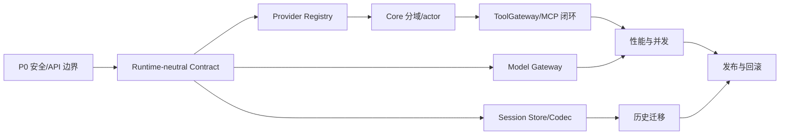

# Pi Desktop 架构优化解决方案

> 本方案基于 `doc/pi-desktop-architecture-analysis.md` 及当前仓库源码制定。本文只定义目标架构、改造顺序、验收标准和风险控制，不包含任何代码实现，也不改变当前运行链路。

## 1. 范围与基线

### 1.1 分析范围

本方案覆盖以下边界：

- Electron 原生壳、Node Host 与 Renderer 的进程边界。
- `desktop-protocol` 的命令、状态、事件和错误契约。
- `desktop-core` 的应用编排、项目/会话/runtime 生命周期。
- `desktop-pi-bridge` 的 Pi RPC、事件归一化和崩溃恢复。
- `desktop-storage` 的 SQLite 元数据索引与 Pi JSONL 会话事实源。
- `desktop-mcp` 的 MCP 连接、工具发现、consent 和工具调用。
- 模型、Skills、Web Search、凭据、HTTP/SSE、安全和发布验证。

本次不包含：

- 修改生产代码、数据库或安装包脚本。
- 立即替换 Pi runtime 或改变默认 Pi 行为。
- 在没有决策确认前承诺某个替代引擎、远程协议或跨平台凭据方案。

### 1.2 当前事实

当前系统是以下纵向闭环：

```text
Electron shell
  -> Node Host / HTTP + SSE
  -> DesktopApplication
  -> PiAgentPort
  -> Pi RPC 子进程
  -> session JSONL

SQLite 保存项目、会话索引、模型、设置和 MCP profile；完整 transcript 仍由 runtime session 文件保存。
```

已经成立、应继续保留的边界：

1. Renderer 不直接接触 Node、文件系统、SQLite、API key 或 Pi 原始类型。
2. Core 通过 Port 编排外部能力，Electron、SQLite、凭据、MCP 和 Pi 在适配器侧实现。
3. SQLite 是可重建索引，不与 runtime 文件重复保存完整会话内容。
4. Electron、Host、Pi RPC 是独立故障边界；当前 Pi bridge 已有 LF JSONL、请求关联、超时和基础恢复。

当前事实由源码中的以下位置支撑：

- Host 装配：`apps/desktop/src/host/main.ts`
- Core 端口：`packages/desktop-core/src/ports.ts`
- Core 编排：`packages/desktop-core/src/application.ts`
- Pi RPC：`packages/desktop-pi-bridge/src/rpc-port.ts`
- Pi 事件归一化：`packages/desktop-pi-bridge/src/normalize.ts`
- 会话扫描：`packages/desktop-storage/src/session-files.ts`
- SQLite 索引：`packages/desktop-storage/src/sqlite-repository.ts`
- MCP 管理：`packages/desktop-mcp/src/manager.ts`

## 2. 结论先行

当前架构不是“全部绑死 Pi”，而是“外壳和应用流程已经抽象，Agent 能力、会话格式、模型配置和工具生命周期仍然 Pi 化”。因此不建议一次性重写 `DesktopApplication` 或直接替换 Pi；建议采用兼容迁移路线：

```text
安全边界稳定化
  -> runtime-neutral 兼容契约
  -> Pi Adapter / Session Codec 隔离
  -> Provider Registry 和能力协商
  -> ToolGateway / ModelGateway
  -> Core 分域、性能和多 runtime
```

最终目标是：

> Desktop Core 面向通用 Agent Runtime Contract；Pi 是默认 Runtime Provider，通过 Pi Runtime Adapter 和 Pi Session Codec 接入；其他本地或远程 runtime 使用相同 Provider 契约接入。

这样既保持当前 Pi 主链路可运行，又把未来替换成本收敛在 provider、adapter、codec 和 gateway 内部。

## 3. 关键问题诊断

### 3.1 Runtime 抽象仍是 Pi 形状

`desktop-core/src/ports.ts` 暴露 `PiAgentPort`、`PiRuntimeOptions`、`PiAgentState`、`PiCommandInfo`，字段中包含 `sessionPath`、`getCommands`、`thinkingLevel` 和 Pi 风格的 `steer/followUp`。`DesktopApplication` 因此在通用用例中直接使用 Pi 名称和 Pi 会话路径。

影响：

- 新 runtime 必须模拟 Pi 命令、事件和 session path，适配器长期被旧契约牵制。
- 不支持 thinking level、Skills、session switch 或 follow-up 的 runtime 只能伪实现或触发 Core 特判。
- 测试替身从 `desktop-core` 反向引用 `desktop-pi-bridge`，包边界出现倒置。

### 3.2 Pi 协议和资源装配集中在 bridge，但领域语义仍外溢

`RpcPiAgentPort` 直接解析 `rpc-entry`，拼接 Pi CLI flags，生成 Pi `models.json`，发送 Pi JSONL command，并把 Pi 事件归一化为桌面事件。这个适配器边界本身是合理的；问题在于 Core 和 storage 仍把其输出称为 Pi state/session，而不是 runtime-neutral state/session。

影响：

- Pi 版本升级会同时影响启动、事件、资源、模型和会话索引。
- 替代引擎需要兼容 Pi 的 `get_state/get_messages/get_commands` 和 session path。
- `buildModelsJson()` 强制 `openai-completions` 和 `reasoning: true`，模型能力模型过窄。

### 3.3 会话存储和索引不可替换

`PiSessionFileRepository` 直接解析 Pi session header、`session_info`、`model_change`、`thinking_level_change` 和 message JSONL；`ConversationIndex.sessionPath`、`leafId` 也直接暴露 Pi 文件概念。

当前“JSONL 事实源 + SQLite 可重建索引”方向正确，但缺少显式 `SessionStore` 和 `SessionCodec`：

- Pi JSONL 是事实源，其他 runtime 没有独立 codec 插槽。
- 远程 session、数据库 session 或 opaque handle 无法自然表达。
- 扫描按文件完整读取，历史增长后会带来启动和切换成本。

### 3.4 MCP 已有基础设施，但没有 Agent 闭环

`desktop-mcp` 已实现 STDIO/HTTP、初始化、工具发现、namespace 冲突、timeout、取消、输出限制和 consent 接口；`createPiMcpTools()` 也已提供 Pi 工具转换函数。

但当前有三个断点：

1. `host/main.ts` 把 consent 固定为 `false`，没有用户授权通道。
2. `createPiMcpTools()` 没有装配到当前 Pi runtime options，MCP 工具不会进入 Agent 对话。
3. Core 没有订阅 MCP 完整事件并发出 `mcp.serverChanged/mcp.toolsChanged`，Renderer 状态可能滞后。

此外，MCP 类型在 `desktop-protocol` 和 `desktop-mcp` 重复定义，`profile.env` 仍可按普通 JSON 保存敏感值。

### 3.5 Host 安全和协议边界不足

当前 Host：

- 固定监听 `127.0.0.1:4317`，Renderer 和其他同用户进程都可尝试访问。
- `/api/state`、`/api/events`、`/api/command` 未统一校验 Host token 或 Origin。
- `readJson()` 没有请求体大小上限。
- 异常统一返回 HTTP 400，无法区分输入错误、未就绪、冲突、权限和内部故障。
- SSE 没有客户端上限、心跳、事件序列号、重连游标和背压策略。

Electron 与 Host 的私有 IPC 已有随机 token；该安全策略应扩展到 Renderer -> Host，而不是只保护 Electron -> Host。

### 3.6 Core 过宽，异步竞态难以演进

`DesktopApplication` 同时管理初始化、窗口、项目、会话、runtime、模型、设置、Skills、MCP、诊断和事件归一化，源码约 1557 行。当前 runtimeId、active session、draft promotion、reconcile 和 recovery 依赖多个字段和 Promise 标记。

短期可以继续工作，但增加多 runtime、远程连接、工具授权或导入迁移后会出现：

- 一个领域改动影响其他领域初始化。
- 旧 runtime 事件与新 runtime 事件的过滤逻辑分散。
- stop/start/recover 的并发状态难以证明。
- 测试需要构造越来越大的 Application fixture。

### 3.7 性能和可观测性瓶颈

- Renderer 每个 delta 触发完整 messages 区域重建，长会话没有虚拟列表或增量节点更新。
- 刷新项目时可能对每个项目调用 `sessions.list`，形成 N+1。
- Core 将活动会话所有消息放入内存 Map；bridge/storage 也会完整获取和扫描消息。
- `DatabaseSync` 在 Host 事件循环中同步执行，数据量增大后会阻塞 SSE 和命令处理。
- runtime 配置变化会停止并重启 Pi，启动成本包含写配置、握手和读取消息/命令。
- 现有测试以单元和 fake port 为主，缺少真实子进程、HTTP 鉴权、SSE 断线、Renderer E2E、安装卸载和跨平台凭据集成测试。

## 4. 优化目标与非目标

### 4.1 优化目标

| 目标 | 可验证结果 |
| --- | --- |
| 保持默认 Pi 可用 | 迁移期间 Pi 0.83.0 的 prompt、stream、abort、session、model、thinking 和 Skills 回归通过 |
| 降低替换 runtime 成本 | 新 provider 只需实现 runtime、session codec、工具/模型转换，不改 Renderer 和主要 Desktop Protocol |
| 保护本机控制面 | 所有 API/SSE 请求通过 token/Origin/体积/超时校验，错误码和状态码可区分 |
| 保持会话可迁移 | 旧 Pi JSONL 可继续打开或只读导入；新 runtime 使用自己的 codec，不覆盖旧事实源 |
| MCP 形成闭环 | 工具可发现、按项目和 trust/consent 调用，状态/工具变化能到达 Renderer |
| 降低 Core 复杂度 | Application 退化为 facade，领域服务和 runtime actor 各自拥有明确状态边界 |
| 控制性能随历史增长 | 会话列表分页/增量索引，消息按游标加载，Renderer 不因单个 delta 全量重绘 |
| 提高发布可信度 | 真实 Pi RPC、HTTP/SSE、Renderer、安装包和升级/卸载成为发布门禁 |

### 4.2 非目标

- 不在第一阶段引入插件市场或任意第三方代码执行框架。
- 不强制一次性支持所有模型协议；先建立 capability 描述和 provider adapter。
- 不把完整 transcript 同时复制到 SQLite；继续保持可重建索引原则。
- 不在没有用户决策的情况下承诺远程 runtime 的数据驻留、账号体系或云端同步。

## 5. 目标架构

### 5.1 分层

```mermaid
flowchart TB
  R[Renderer] --> DP[Desktop Protocol]
  DP --> API[Host API Gateway]
  API --> APP[Desktop Application Facade]
  APP --> PROJ[Project Service]
  APP --> CONV[Conversation Service]
  APP --> RUN[Runtime Service]
  APP --> MODEL[Model Gateway]
  APP --> TOOL[Tool Gateway]
  APP --> SEC[Policy and Consent]
  RUN --> REG[Runtime Provider Registry]
  REG --> PI[Pi Runtime Adapter]
  REG --> LOCAL[Other Local Adapter]
  REG --> REMOTE[Remote Adapter]
  CONV --> STORE[Session Store]
  STORE --> CODEC[Session Codec Registry]
  CODEC --> PIC[Pi Session Codec]
  CODEC --> JSON[Generic/Other Codec]
  TOOL --> MCP[MCP Manager]
  TOOL --> BUILTIN[Built-in Tools]
  MODEL --> PROVIDERS[Provider-specific Model Adapters]
  PI --> RPC[Pi JSONL RPC]
  PIC --> FILES[Pi session JSONL]
  STORE --> INDEX[SQLite Rebuildable Index]
```



### 5.2 运行时中性契约

建议引入以下概念，先以兼容别名过渡：

- `AgentRuntimePort`：启动、停止、prompt、steer、follow-up、abort、session 操作、消息读取、模型/思考设置和事件订阅。
- `RuntimeStartOptions`：工作目录、会话引用、模型选择、工具/扩展、信任策略和 runtime-specific options。
- `RuntimeState`：streaming 状态、模型引用、会话引用、消息计数和 runtime 状态。
- `AgentEvent`：message、delta、tool、runtime、diagnostic、error 等中性事件。
- `RuntimeCapabilities`：显式声明 runtime 支持的能力，不再假定所有 runtime 都支持所有控件。
- `RuntimeSessionRef`：opaque 的 runtime session handle。Pi adapter 内部再映射到路径。
- `RuntimeCommand`/`SkillDescriptor`：命令来源和作用域中性化，Pi command 只是一种 adapter 输出。

能力至少覆盖：

```text
prompt, steer, followUp, abort, sessionCreate, sessionSwitch,
messageRead, streaming, toolCalling, skills, commands,
thinkingLevel, modelSwitch, modelStreaming, multimodal
```

Core 只按能力决定命令是否可用；Renderer 根据 state/capabilities 隐藏或禁用不支持的控件。

### 5.3 Provider 注册与监督

定义 `AgentRuntimeProvider` 概念，包含：

- `id`、版本和描述。
- capability manifest。
- `create(startOptions)`。
- `healthCheck()`。
- 生命周期和 dispose。
- adapter/codec/tool/model 版本兼容信息。

Host 通过 `RuntimeProviderRegistry` 装配 `pi`，默认 provider 仍为 Pi。未来增加本地或远程 runtime 时，只新增 provider，不在 `DesktopApplication` 内添加 `if (provider === ...)`。

每个活动 runtime 建议由一个 per-runtime actor/command queue 串行化生命周期命令：

```text
start -> ready -> running -> stopping -> stopped
                    |             |
                    +-> recovering+
                    +-> error
```

恢复应记录 generation、最后确认的 prompt/request、事件序号和用户可见状态。第一版不自动重放未确认 prompt，避免重复执行；后续可由用户显式选择重试。

### 5.4 Session Store 与 Codec

将当前 `SessionFileRepository` 演进为：

- `SessionStore`：创建、读取、列表、分页、刷新、导入、删除和重建索引。
- `SessionCodec`：识别、读取摘要、读取消息、写入/导入和格式版本迁移。
- `SessionHandle`：`runtimeId/backendId/codecId/opaqueRef`，不把路径当作通用 ID。
- `PiSessionCodec`：保留 Pi JSONL 读取和历史兼容。

建议 metadata 的 conversation 记录增加：

```text
runtimeProviderId
runtimeSessionRef
sessionCodecId
sessionFormatVersion
historyAccess: continue | read-only | import-required | missing
```

SQLite 仍是索引，不保存完整 transcript。重建流程以 codec 提供的摘要为输入，并使用文件大小、mtime、格式版本和 hash/offset 做增量扫描；坏文件继续进入 diagnostics，不阻塞其他会话。

### 5.5 ToolGateway 与 MCP

统一模型：

```text
ToolDescriptor
  name / namespace / description / inputSchema
  source / projectScope / trustRequirement / consentRequirement

ToolGateway
  list(context)
  call(name, args, context, signal)
  subscribe(event)
```

MCP、内置工具和 Web Search 都成为 ToolGateway provider。Pi adapter 将通用工具转换为 Pi tool definition；其他 runtime 使用其自身的 tool schema。

consent 流程必须由 Host 掌握：

1. ToolGateway 产生带 requestId 的 `consent.required`。
2. Core/Host 将请求发送到 Renderer。
3. 用户批准一次、当前项目、当前会话或永久策略。
4. 决策写入安全的 policy store，不把 secret 或完整 arguments 广播给不必要的客户端。
5. 批准/拒绝结果回到 pending tool call，超时默认拒绝。

MCP profile 中的敏感环境变量只保存 credentialRef；普通 env 与 secret 引用分开。MCP 类型只保留一份 canonical 定义，其他包导入该定义，避免结构类型漂移。

### 5.6 Model Gateway

将当前模型 profile 从“Pi models.json 输入”提升为通用模型描述：

- `protocol`: openai-compatible、anthropic、local、custom 等。
- `endpoint`、认证方式和 credentialRef。
- context window、streaming、tool calling、thinking、multimodal 等 capability。
- provider-specific options 置于受校验的扩展字段，不能由 bridge 盲目假设。

Pi adapter 负责将 Model Gateway 输出转换为 Pi `models.json`；Core 不再知道 `openai-completions` 或环境变量占位符。

### 5.7 Host API 与事件流

建议统一增加 `HostApiGateway`：

- 启动时生成随机 token，Electron 通过受保护的启动参数或 IPC 传递给 Renderer。
- 优先使用动态 loopback 端口；Electron 等待 Host readiness 消息后加载 URL。
- `/api/state`、`/api/events`、`/api/command` 全部校验 token、Origin/Referer 策略、方法和 content type。
- 请求体设置明确上限，超过上限立即终止读取。
- 为命令、事件和日志统一 requestId/correlationId。
- 将 `DesktopErrorCode` 映射到 400/401/403/404/409/408/413/429/500，而不是全部 400。
- SSE 增加单调 `eventId`、心跳、客户端上限、每客户端缓冲上限和断线后的 `Last-Event-ID` 全量/增量恢复策略。
- 关闭连接、应用退出、runtime 替换时明确发送终止事件，避免悬挂请求。

## 6. 具体改进方案

### 6.1 契约层

1. 新增 runtime-neutral 类型和 Port，保留 `PiAgentPort`/`PiRuntimeOptions` 兼容别名。
2. 将 Pi 事件归一化结果重命名为 `AgentEvent`，在边界处保留旧 event mapping。
3. 用 `RuntimeCapabilities` 驱动 UI 和命令可用性。
4. 将 `sessionPath` 替换为 `runtimeSessionRef`，Pi adapter 内部保留路径映射。
5. 将测试 fake 移到 core test support 或单独的 contract-test package，解除 core -> bridge 反向依赖。
6. 为每个 Port 编写 contract tests：启动、ready、prompt delta、tool、abort、session switch、超时、退出、重启和 secret redaction。

### 6.2 Pi Adapter 层

1. 新建 `PiRuntimeAdapter`，集中 Pi `rpc-entry`、CLI flags、`models.json`、Pi command/event mapping。
2. 将 Pi 版本号、资源目录和协议版本放到 adapter manifest，不散落在 Host、Core 和打包脚本。
3. 为 Pi RPC 增加协议版本/能力握手；不匹配时返回结构化 `PROTOCOL_ERROR` 和升级提示。
4. 让 recovery supervisor 发出 `recovering/failed` 状态，记录 attempt、delay、last known session 和用户操作建议。
5. 把工具注入点设计为 adapter 的 `setTools`/`createRuntimeTools`，但工具授权仍由 ToolGateway/Host 决定。

### 6.3 Session 与索引层

1. 先包裹现有 `PiSessionFileRepository` 为 `PiSessionCodec`，不改变 Pi JSONL 解析规则。
2. 为 metadata 增加 provider/codec/ref 字段，并提供一次性 schema migration 与回滚备份。
3. 保留旧 `sessionPath` 的读取兼容，迁移后生成 opaque ref；缺失文件标记为 `missing` 而不是删除事实源。
4. 将全量 `scan()` 拆为摘要索引、增量刷新和按 session 读取消息三个路径。
5. 会话列表增加分页/排序游标；打开会话时只加载可视窗口附近消息，按需追加历史。
6. 对 Pi 旧会话提供 `continue`、`read-only`、`import-required` 状态，不静默转换或丢失不兼容字段。

### 6.4 Core 分域

保留 `DesktopApplication` 作为兼容 facade，内部逐步拆出：

- `ProjectService`：项目、canonical path、trust 和项目选择。
- `ConversationService`：会话列表、draft promotion、标题、导入和刷新。
- `RuntimeService`：provider 选择、runtime actor、能力、恢复和当前 runtime snapshot。
- `ModelService`：模型 profile、凭据引用、默认模型和连接测试。
- `ToolService`：ToolGateway、MCP scope、consent 和工具事件。
- `SettingsService`：设置校验、迁移、窗口/快捷键配置。
- `DiagnosticsService`：结构化诊断、脱敏、导出、日志轮换。

每个服务只通过 Port 访问外部系统；Facade 负责维持旧 command/result 兼容。状态更新采用单向事件：领域服务更新自身状态，Facade 聚合公开 `DesktopState`。

### 6.5 MCP 闭环

1. 抽取 canonical MCP 类型，`desktop-mcp` 和 protocol 只保留一个来源。
2. Host 提供真实 `ConsentBroker`，支持 project trust、一次性授权和拒绝/超时。
3. Core 订阅 `McpManager`，将 server/tools/tool execution 事件转换为 DesktopEvent。
4. 将 `createPiMcpTools()` 的生命周期接入 runtime adapter；runtime 重启或工具变化时更新工具集合，而不把 MCP 逻辑复制进 Pi bridge。
5. Renderer 增加 pending consent、server status、tool list、错误和取消状态的闭环视图。
6. profile.env 改为非敏感变量与 credentialRef 分离存储；诊断和 `/api/state` 继续脱敏。

### 6.6 安全改造

优先级为 P0：

1. Host 启动随机 token，并在所有 API/SSE 请求校验；拒绝无 token、错误 token 和跨 Origin 请求。
2. 使用动态 loopback 端口，或至少在 Electron 侧生成随机端口并通过 readiness 传递。
3. 设置 JSON body、header、SSE client、单请求执行时间和并发命令上限。
4. 统一错误映射，禁止把堆栈、路径中的 secret 或 provider key 返回 Renderer。
5. 为 MCP STDIO command、HTTP URL、project path 和资源目录增加 allowlist/canonicalize 校验。
6. Linux 从 `MemorySecretStore` 升级到明确的 OS secret strategy；不支持安全存储时将 capability 标为不可用，而不是静默丢失凭据。
7. 将 Host token、Origin policy、body limit、SSE sequence 和 secret redaction 纳入集成测试。

### 6.7 性能改造

分两批进行：

第一批低风险优化：

- `/api/state` 与项目会话列表拆分，Renderer 只刷新受影响的资源。
- 为会话列表提供按 project、updatedAt、cursor 的分页接口，消除 N+1。
- 事件携带序号和最小 payload，命令完成后只刷新相关 slice。
- Renderer 对 message delta 做批量合并，按 animation frame 更新单条消息节点。
- 对消息读取增加最大窗口和历史游标，避免每次切换都取完整 transcript。

第二批结构优化：

- 将 SQLite 同步读写移至 worker/专用队列，或明确限制同步操作的大小和频率。
- session codec 维护增量索引，按文件偏移/mtime 读取新增内容。
- runtime profile 变化分为可热更新和必须重启两类，减少不必要的 Pi 重启。
- 在确认用户需要并行任务后再引入 Runtime Pool；默认仍保持单活动 runtime。

### 6.8 可观测性与发布

统一记录：

```text
requestId, eventId, projectId, sessionId, runtimeId,
providerId, operation, durationMs, outcome, retryAttempt
```

增加以下验证层级：

- Port contract tests：所有 runtime provider 共用。
- Pi RPC integration：真实子进程、LF framing、握手、模型/工具/事件和退出。
- Host integration：token、Origin、body limit、HTTP status、SSE reconnect/heartbeat。
- Storage integration：迁移、备份、坏 JSONL、增量索引、codec 兼容。
- Renderer E2E：创建项目、trust、session、prompt、stream、abort、MCP consent、断线恢复。
- Packaging smoke：空目录启动、资源完整性、安装/卸载、单实例、托盘、快捷键和 child process 生命周期。
- Release preflight：版本、依赖、主题资源、Pi RPC 入口、诊断脱敏和回滚备份。

## 7. 分阶段实施路线

### 阶段 0：冻结基线与决策门

交付物：


- 记录当前 Pi 0.83.0 的协议、事件、资源和 session fixture。
- 为现有命令、状态、事件和错误建立“不可回归”清单。
- 明确是否必须支持替代引擎、远程 runtime、并行 runtime 和跨平台发布。
- 明确历史会话策略：继续、只读、导入或放弃某些 Pi 专属字段。

门槛：现有测试、TypeScript、真实 Pi 启动和打包 smoke 均有可重复命令与产物。

### 阶段 1：P0 Host 安全与 API 契约

交付物：

- token/Origin 中间件、动态端口或受保护端口协商。
- body/header/client/timeout 限制。
- 结构化 HTTP status、错误码和 requestId。
- SSE heartbeat、eventId、断线恢复和客户端上限。

门槛：无 token/错误 token/超大 body/跨 Origin 请求全部被拒绝；Renderer 正常启动、刷新和重连不回退到不安全路径。

### 阶段 2：Runtime-neutral 兼容契约

交付物：

- `AgentRuntimePort`、`AgentEvent`、`RuntimeState`、`RuntimeCapabilities`、`RuntimeSessionRef`。
- 旧 Pi Port 类型兼容别名和 adapter mapping。
- contract tests 与独立 fake runtime。
- Core 测试不再从 bridge 导入 fake。

门槛：默认 Pi 功能不变；一个最小第二 fake provider 可以在不修改 Renderer 的情况下通过 contract tests。

### 阶段 3：Pi Adapter 与 Session Codec

交付物：

- `PiRuntimeAdapter` 集中 Pi 版本/CLI/RPC/模型/事件翻译。
- `SessionStore`、`SessionCodec`、`PiSessionCodec`。
- metadata migration、opaque session ref、旧 session 只读/继续状态。
- 增量扫描和会话分页设计。

门槛：旧 Pi JSONL 可继续打开；新建会话不写入错误 provider/codec；坏文件不阻塞其他项目；migration 可备份、可回滚。

### 阶段 4：Provider Registry 与 Core 分域

交付物：

- `AgentRuntimeProvider` 和 registry。
- `RuntimeService`/actor 管理 start/stop/recover/generation。
- `DesktopApplication` 保留 facade，项目、会话、模型、设置和诊断逐步迁移为服务。
- provider/capabilities 写入项目或会话元数据。

门槛：Pi 是默认 provider；替换为 fake/第二 provider 不需要修改协议和 Renderer；旧命令错误码保持兼容。

### 阶段 5：ToolGateway 与 MCP 闭环

交付物：

- canonical Tool/MCP 类型。
- ToolGateway、ConsentBroker 和 policy store。
- MCP server/tools/tool execution 事件接入 DesktopEvent。
- Pi adapter 的工具注册/更新/取消链路。
- Renderer consent、工具状态和错误 UI。

门槛：可信项目可调用工具；不可信项目触发授权；拒绝/超时不会调用 server；secret 不出现在 state、事件或诊断；工具变化可实时反映。

### 阶段 6：Model Gateway 与性能

交付物：

- provider protocol/capabilities/credential strategy。
- Pi models.json adapter。
- session/message 分页、增量刷新、Renderer 单条增量渲染。
- N+1 消除、SQLite 队列或 worker 方案。

门槛：长会话打开时间、单 delta 渲染时间、内存占用和 Host event-loop 阻塞有基线与改善结果；模型切换只在必要时重启 runtime。

### 阶段 7：迁移、发布与回滚

交付物：

- provider/codec 迁移工具和诊断报告。
- 旧 Pi session 兼容窗口和 deprecation 说明。
- Windows x64 现有安装包回归；再按决策扩展 macOS/Linux。
- 版本、资源、依赖、签名/未签名、安装/卸载和回滚策略文档。

门槛：空目录安装后可启动；单实例、托盘、快捷键、Host/Pi child process、卸载和异常退出均有验证记录；迁移失败不破坏原始 session 和 SQLite 备份。

## 8. 依赖关系与优先级



依赖原则：

- 安全和 HTTP 契约可以先独立落地。
- Runtime-neutral contract 必须先于第二 provider、Session Codec 和 ToolGateway 的跨 runtime 化。
- Session Codec 与 Provider Registry 可以并行设计，但 metadata migration 需要先冻结字段。
- MCP 工具注入必须依赖 ToolGateway 和 runtime capability，不应直接把 MCP 逻辑写进 Pi bridge。
- Runtime Pool、远程 runtime 和复杂虚拟列表属于后续优化，不能阻塞第一条可替换链路。

## 9. 验收指标

### 9.1 功能与兼容

- Pi 默认 provider 的已有命令、事件、session、model、thinking、Skills 和 recovery 回归通过。
- 新 fake/第二 provider 通过同一套 runtime contract tests。
- Pi 旧 session 至少可读取摘要和消息；不兼容字段有明确状态，不静默丢弃。
- MCP 工具从发现、授权、调用、取消到结果/错误均可追踪。

### 9.2 安全

- API/SSE 无 token、错误 token、错误 Origin 全部拒绝。
- 超过 body、header、SSE buffer、并发和执行时间限制的请求可预测失败。
- `/api/state`、SSE、诊断、日志和错误响应均不包含 API key、MCP secret 或完整敏感环境变量。
- 不支持安全凭据存储的平台显式显示 capability 不可用，不产生“保存成功但重启丢失”的假成功。

### 9.3 性能

建立并持续记录以下基线：

- Host 启动到 `/api/state` ready 的时间。
- 首次打开项目、会话列表和长会话的延迟。
- 单条 message delta 到 Renderer 可见的延迟。
- 100/1000/10000 条历史消息下的内存和渲染耗时。
- MCP tool call 的 P50/P95 延迟和超时比例。
- runtime 重启次数及配置变更触发原因。

### 9.4 可靠性与发布

- Pi 子进程异常退出后恢复尝试、失败原因和用户操作建议可见。
- SSE 断线后不会丢失最终状态；重复事件可去重。
- SQLite migration 前有备份，失败可回滚。
- 安装包从空目录启动并完成窗口、托盘、单实例、快捷键、Host、Pi 子进程、卸载验证。

## 10. 风险与缓解

| 风险 | 触发原因 | 缓解措施 |
| --- | --- | --- |
| Pi 上游协议变化 | `rpc-entry`、事件或资源改变 | Pi adapter 集中版本差异；协议握手；真实 RPC fixture；保留兼容窗口 |
| 兼容契约变成另一层大抽象 | 只改名、不拆职责 | 先以 capability 和 opaque ref 解决真实耦合；每个 Port 配 contract tests；禁止 Core 加 provider 特判 |
| Session migration 丢历史 | codec 不完整、路径失效 | 原始 JSONL 只读保留；SQLite 迁移前备份；显示 `read-only/import-required`；迁移报告可审计 |
| MCP 工具越权 | trust/consent 只在 UI 或 runtime 侧判断 | ToolGateway/Host 统一策略；默认拒绝；requestId、超时、取消和审计事件 |
| secret 泄露 | env、错误、诊断或子进程可见性 | credentialRef；统一 redaction；最小环境；威胁模型明确同用户进程边界 |
| Host 安全改造破坏开发模式 | Electron、浏览器 dev、测试启动路径不同 | token/port 注入抽成单一 bootstrap；保留 dev helper；增加两种启动模式的集成测试 |
| Core 拆分引入竞态 | start/stop/recover/切换并发 | per-runtime actor；generation 校验；旧事件丢弃；先保留 facade 再逐步迁移 |
| 性能优化改变事件语义 | 增量索引/批量事件导致顺序变化 | eventId/sequence；契约测试；最终 state 可重建；UI 只依赖公开事件契约 |
| 跨平台凭据不可用 | Linux 无 OS secret backend | 明确支持矩阵；优先 Secret Service/libsecret；能力不可用时阻止保存并给出诊断 |
| 发布目标超出实现范围 | manifest 声明的 macOS/MSI/签名/回滚尚未落地 | 将 release manifest 分为 target 与 verified；每个平台单独门禁；不把目标当现状 |

## 11. 需要在实施前确认的决策

以下问题会影响目标契约，应作为项目决策门记录，而不是在实现中隐式假设：

1. 第一阶段是否只要求“可替换本地 runtime”，还是必须包含远程 HTTP/WebSocket runtime。
2. 是否要求所有旧 Pi session 可继续执行，还是允许部分历史只读/导入。
3. 是否接受动态 loopback 端口和每次启动 token，是否需要兼容纯浏览器开发模式。
4. 是否需要同时运行多个项目/runtime；如果需要，允许的并发数和资源上限是多少。
5. 首批模型协议是否包含 Anthropic 原生协议、本地模型和多模态；各自认证方式是什么。
6. MCP consent 的授权粒度是单次、会话、项目还是永久；策略存放在哪里、如何撤销。
7. Linux 凭据的正式支持范围和不可用时的用户体验。
8. Windows 之外的发布目标、是否签名、是否需要自动更新、原子升级和回滚。

## 12. 最终建议

本项目当前最有价值的资产是已经打通的 Electron/Host/Core/Pi RPC 纵向链路和清晰的 Ports and Adapters 方向。优化应围绕“稳定边界、逐层下沉 Pi 细节、保持可回滚”展开：

1. 先补 Host API 安全和事件流可靠性，避免在不稳定控制面上继续扩展。
2. 用 runtime-neutral contract、capabilities 和 opaque session ref 取代 Pi 形状，但保留兼容别名。
3. 将 Pi RPC、模型 JSON、CLI 参数、事件和 JSONL 会话全部收拢到 Pi Adapter/Codec。
4. 用 Provider Registry、ToolGateway、ModelGateway 为替代引擎和 MCP 建立正式扩展点。
5. 以 Session Store、Core 分域、增量索引和 Renderer 增量渲染解决长期维护和性能问题。
6. 每个阶段都以真实 Pi 回归、contract tests、HTTP/SSE、存储迁移和打包 smoke 作为门禁，不以类型检查通过代替系统验收。

完成上述路线后，Pi 仍可作为默认实现继续使用；当 Pi 停更或不可用时，替换范围将收敛到 Runtime Provider、Session Codec、Tool/Model Adapter 和相应迁移，而无需重写 Electron 壳、Renderer、Desktop Protocol 或整个应用业务层。
