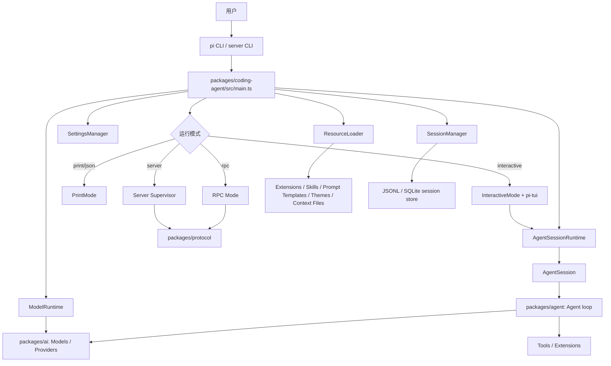
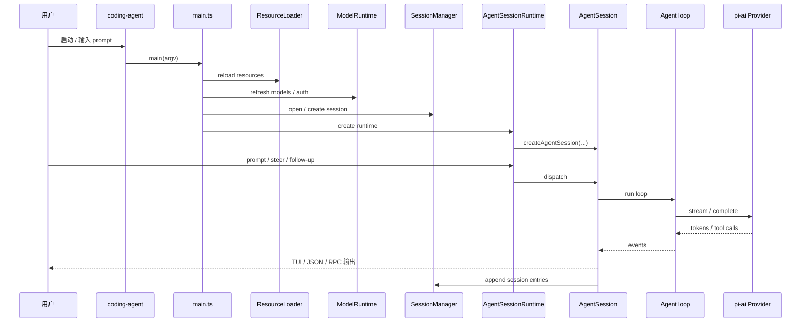
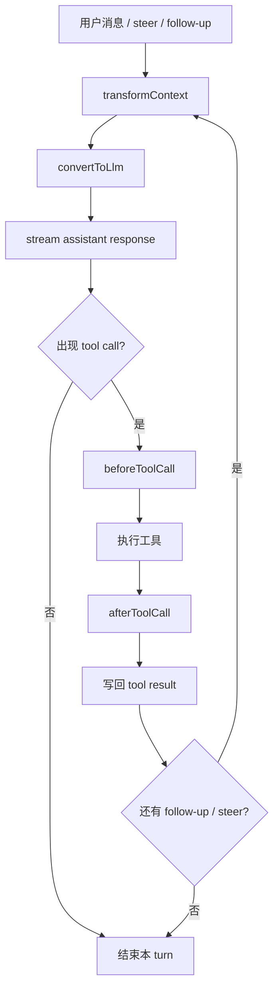
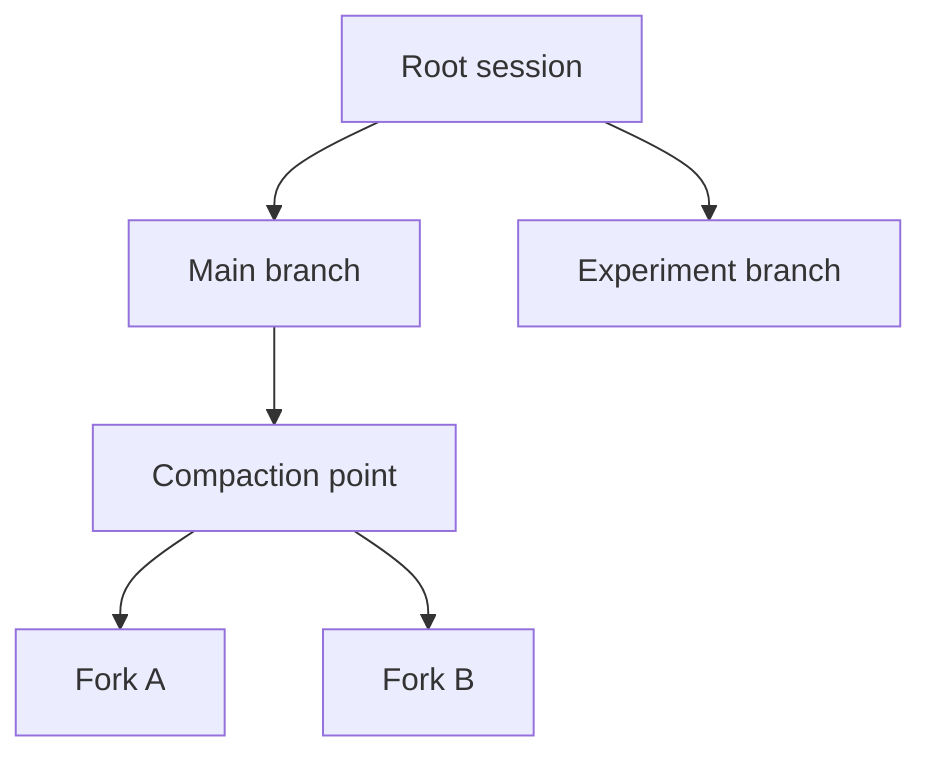
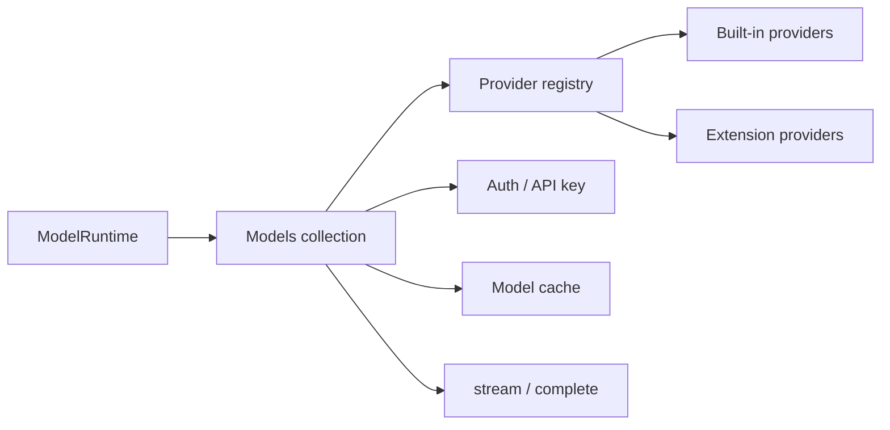
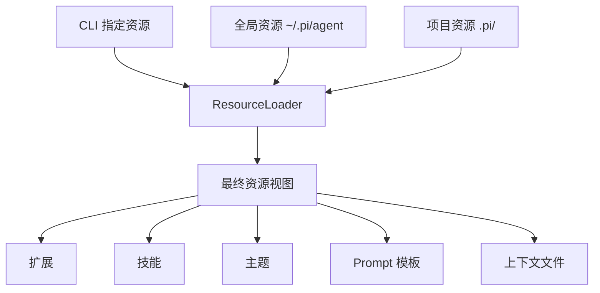

# Pi 项目整体架构分析

> 基于仓库源码整理，重点解释代码分层、运行流程、会话机制、模型抽象和扩展点。

## 1. 一句话概括

Pi 是一个终端优先的 coding agent 平台。它把“用户交互、会话管理、模型调用、工具执行、资源加载、持久化、远程控制”拆成多个清晰层次，再由 `packages/coding-agent` 统一编排。

你可以把它理解成：

- 最上层是 CLI / TUI / RPC / Server
- 中间层是 session、settings、resources、model runtime
- 底层是 agent loop、LLM providers、terminal rendering、protocol 和 storage

这套结构的核心特点是：分层明确、扩展点多、模式切换清晰。

## 2. 仓库总体结构

| 包 | 角色 | 关键职责 |
| --- | --- | --- |
| `packages/coding-agent` | 主应用与 SDK | 解析参数、加载资源、管理会话、选择模型、组织交互模式 |
| `packages/agent` | Agent 运行核心 | 对话循环、工具调用、消息流转、steer/follow-up、事件输出 |
| `packages/ai` | 模型与供应商抽象 | 多供应商模型注册、鉴权、刷新、流式调用、兼容层 |
| `packages/tui` | 终端 UI 基础库 | 差分渲染、输入框、选择器、Markdown、图片、布局 |
| `packages/protocol` | 远程协议 | 会话/命令/事件的帧格式与 schema |
| `packages/storage/sqlite-node` | 持久化存储 | SQLite 会话存储、分支、材料化上下文 |
| `packages/server` | 进程外监督器 | 管理常驻实例、RPC、启动/停止/查询 |

从 `package.json` 的 build 顺序也能看出层级关系：`tui -> ai -> agent -> storage -> protocol -> coding-agent -> server`。这就是它的依赖骨架。

## 3. 总体架构图

这张图的重点是：`coding-agent` 不是“一个大函数”，而是一个编排器。真正的对话能力在 `packages/agent`，模型供应能力在 `packages/ai`，终端表现层在 `packages/tui`。

## 4. 启动流程

启动时，主程序大致按下面顺序工作：

1. 解析命令行参数。
2. 处理诸如 `--help`、配置、认证、包管理之类的控制命令。
3. 初始化 `SettingsManager`。
4. 通过 `ResourceLoader` 加载系统提示、AGENTS.md/CLAUDE.md、技能、主题、扩展等资源。
5. 创建 `ModelRuntime`，读取内置模型、动态模型、运行时 API key 和扩展注册的 provider。
6. 创建 `SessionManager`，决定新会话、继续会话、分支、导入或恢复。
7. 构建 `AgentSessionRuntime`，把 session、settings、resources、model runtime 绑定在一起。
8. 按模式进入交互：TUI、print/json、RPC 或 server。

## 5. 核心对话循环是怎么跑的

`packages/agent` 是真正的“执行引擎”。它不是简单地把消息扔给模型，而是处理一整轮 agent turn：

1. 接收用户消息或 steer/follow-up。
2. 把 agent 内部消息转换成 LLM 可消费的格式。
3. 调用模型流式输出。
4. 识别工具调用。
5. 按配置执行工具：可以顺序，也可以并行。
6. 将工具结果追加回上下文。
7. 再决定是否进入下一轮，或者结束本 turn。

这里有几个很关键的设计点：

- `beforeToolCall` / `afterToolCall` 让工具执行能被拦截、改写或终止。
- `steer` 和 `follow-up` 不等于重新开一个会话，而是向当前 turn 注入额外指令。
- 工具执行可以并行，也可以强制串行。
- `Agent` 是状态对象，负责维护流式状态、待执行工具、错误信息和队列。

## 6. 会话模型：不是一条直线，而是一棵树

Pi 的会话不是简单 transcript，而是“可分叉的树”。

`packages/coding-agent/src/core/session-manager.ts` 里，session 以 JSONL 形式保存，并支持：

- 新建会话
- 继续会话
- 分叉会话
- 导入/导出
- compaction 后的上下文重建
- 标签、分支摘要、统计信息

这种设计的好处是：

- 可以保留完整历史；
- 可以从任意点分叉实验；
- 可以压缩上下文而不丢掉结构；
- 可以恢复成“当前有效分支”的上下文。

在另一层实现上，`packages/storage/sqlite-node` 提供了 SQLite 后端，把 session entries、branch entries 和 materialized branch 结构持久化，适合更快的查询和长期存储。

## 7. 模型与供应商体系

`packages/ai` 是 Pi 的模型抽象层。它做的不是“再包一层 OpenAI SDK”，而是统一不同厂商的接口差异。

核心概念有三个：

### Provider

Provider 描述一个模型来源，包含：

- `id` / `name`
- `baseUrl`
- headers / auth
- 刷新模型列表
- 流式调用能力

### Models

`Models` 是 provider 集合和调度器，负责：

- 维护可用模型缓存
- 处理登录/注销/刷新
- 根据 auth 状态筛选模型
- 选择正确的 provider 发起请求

### createProvider

它把静态模型、动态模型和具体 API 实现组合起来，形成统一入口。

另一个关键点是默认模型选择。`model-resolver.ts` 会根据 CLI 参数、会话记录、默认设置、provider 可用性来决定启动时用哪个模型和哪种 thinking level。也就是说，模型选择不是硬编码死的，而是“优先级决策”。

## 8. 资源系统：把定制能力做成一等公民

Pi 的资源系统非常重要。`packages/coding-agent/src/core/resource-loader.ts` 会合并多类资源：

- 全局资源：`~/.pi/agent`
- 项目资源：项目内 `.pi/`
- CLI 指定路径
- 扩展发现的资源

资源类型包括：

- extensions
- skills
- prompt templates
- themes
- context files（如 AGENTS.md / CLAUDE.md）
- system prompt 片段

这里还有一个很强的设计：信任边界。

- 项目资源并不是默认全部可信；
- 在信任决策前，只加载用户级/全局级资源和 inline CLI 扩展；
- 通过后再加载项目本地资源。

这能避免“打开一个仓库就自动执行其全部定制内容”的风险。

## 9. 运行模式：同一个内核，四种外壳

Pi 把运行方式分得很清楚。

| 模式 | 作用 | 适合场景 |
| --- | --- | --- |
| `interactive` | 终端交互界面 | 人工协作、日常使用 |
| `print` / `json` | 单次执行并输出结果 | 脚本、CI、管道 |
| `rpc` | stdin/stdout JSONL 协议 | 进程集成、外部宿主 |
| `server` | 常驻实例监督器 | 长连接、多会话、远程控制 |

这说明 Pi 的架构不是“只有一个 CLI”。它把人机交互、脚本调用和进程集成拆成了不同外壳，但底层复用同一套 session / agent / model 核心。

## 10. 远程协议与服务层

`packages/protocol` 定义了远程控制所需的消息格式、分帧、编解码和命令 schema。它关心的是：

- session snapshot
- command / response
- progress event
- attach / detach
- prompt / steer / abort
- set_model / set_thinking

`packages/server` 则是在协议之上的监督器，负责：

- 启动和管理常驻实例
- 提供 RPC / RPC stream
- 列出、查询、停止实例
- 做进程外协调

这层很适合把 Pi 放到更大系统里当一个“可被调度的 agent 服务”。

## 11. 终端 UI 为什么能做得比较顺

`packages/tui` 不是简单的打印库，而是一套终端组件系统。它提供：

- 差分渲染
- 输入框 / 编辑器
- 下拉选择器 / 列表
- Markdown 渲染
- 图片与终端图像支持
- 焦点管理
- overlay 机制

这意味着 `InteractiveMode` 可以把消息流、工具输出、命令面板、选择器、设置页、模型选择器放在同一个 UI 体系里，而不是东拼西凑。

## 12. 这个项目的关键设计取舍

我认为最值得学习的点有这些：

- 分层很硬：UI、会话、模型、代理执行、协议、存储，各层职责清楚。
- Provider 抽象做得早：厂商变化大，但上层调用面保持统一。
- Session 是树，不是线：这让分支、恢复、压缩都自然很多。
- 资源系统一等公民：技能、模板、主题、上下文文件都可配置。
- 信任边界明确：项目资源和全局资源不是同一权限级别。
- 多运行模式共享内核：交互、脚本、RPC、服务端不重复造轮子。
- 兼容层保留旧接口：`pi-ai` 里还有 compat 入口，说明它对演进很谨慎。
- 不把权限系统内置进核心：README 里明确建议外部容器化处理，更像是“通用引擎”而不是“全功能平台代理”。

## 13. 建议的阅读顺序

如果你想最快建立心智模型，建议按这个顺序看：

1. `packages/coding-agent/src/main.ts`
2. `packages/coding-agent/src/core/agent-session-runtime.ts`
3. `packages/coding-agent/src/core/agent-session.ts`
4. `packages/coding-agent/src/core/model-runtime.ts`
5. `packages/coding-agent/src/core/resource-loader.ts`
6. `packages/coding-agent/src/core/session-manager.ts`
7. `packages/agent/src/agent.ts`
8. `packages/agent/src/agent-loop.ts`
9. `packages/ai/src/models.ts`
10. `packages/ai/src/providers/all.ts`
11. `packages/coding-agent/src/modes/interactive/interactive-mode.ts`
12. `packages/coding-agent/src/modes/rpc/rpc-mode.ts`
13. `packages/tui/src/tui.ts` 和 `packages/tui/src/TuiAltScreen.ts`
14. `packages/protocol/src/schemas.ts`
15. `packages/storage/sqlite-node/src/storage/index.ts`

如果只读四个文件，优先看：

- `packages/coding-agent/src/main.ts`
- `packages/coding-agent/src/core/agent-session.ts`
- `packages/agent/src/agent-loop.ts`
- `packages/ai/src/models.ts`

## 14. 总结

Pi 的整体架构可以概括成一句话：用 `coding-agent` 做编排层，用 `agent` 做执行层，用 `ai` 做模型适配层，用 `tui` 做交互层，再用 `protocol` / `storage` / `server` 补齐远程化和持久化能力。

它的优势不是“单点技巧”，而是整体分层清晰、资源可扩展、会话可分叉、模型可替换、模式可复用。对于学习 coding agent 架构的人来说，这个项目非常适合拿来拆解。
