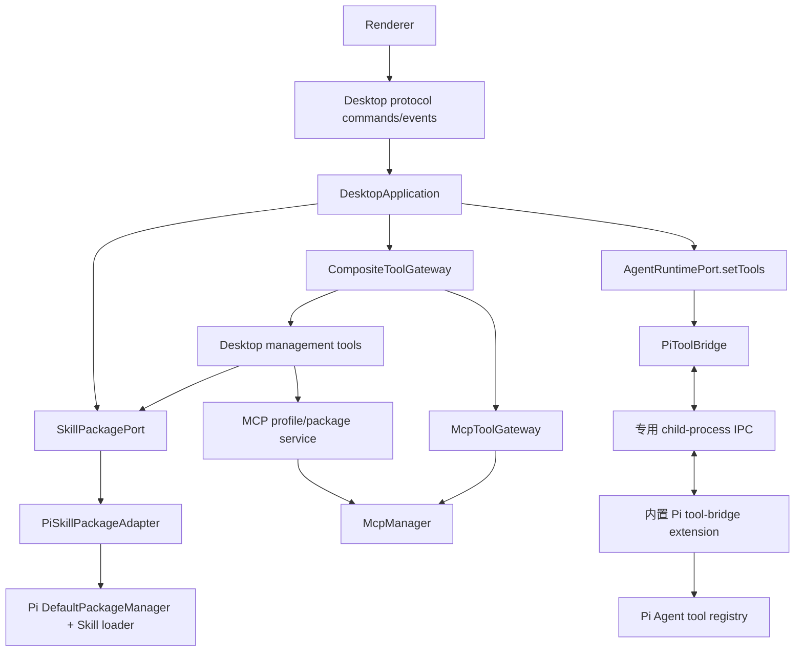
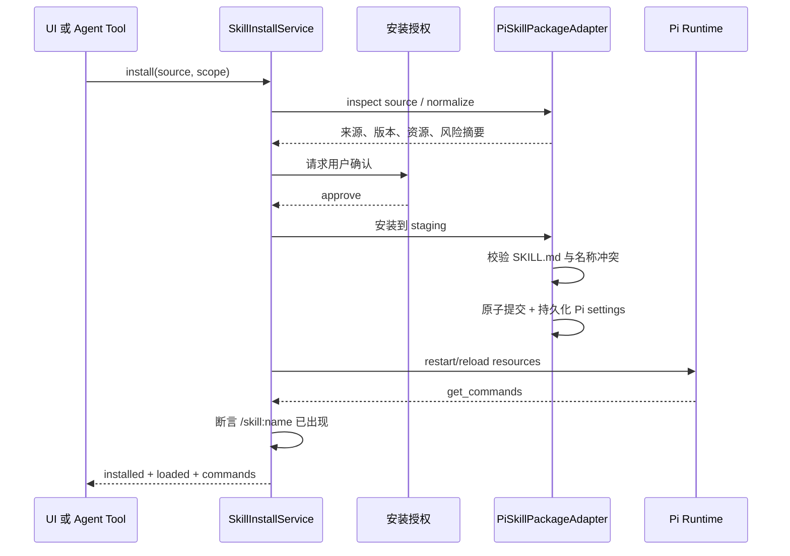

# Pi Desktop Skill 与 MCP 安装、展示和运行闭环方案

## 1. 文档目的

本文基于 2026-08-05 的当前仓库、锁定的 `@earendil-works/pi-coding-agent@0.83.0`、
`@modelcontextprotocol/sdk@1.30.0` 及其随包文档进行分析，目标是解决以下完整链路，而不只是补齐设置页：

1. 用户从设置页安装或添加 Skill 后，设置页立即显示真实安装状态。
2. 已加载 Skill 出现在消息输入框的斜杠命令菜单中，并能通过 `/skill:<name> [参数]` 真正执行。
3. 用户从设置页安装或添加 MCP 后，设置页显示安装、连接、工具发现和 Agent 可用状态。
4. 用户在对话中要求 Agent 安装 Skill 或 MCP 时，Agent 能通过受控工具完成同一套安装流程。
5. 开发环境和安装后的 Windows/macOS 应用都不依赖偶然存在的系统 `node`、`npm` 或 `npx`。
6. “已保存”“已连接”“Agent 可调用”“已实际调用”必须是不同、可验证的状态。

本文是实施方案，不包含生产代码修改。

## 2. 结论摘要

当前 Skill 功能已经有一条接近可用的 Pi 原生链路，但设置页只有“额外目录引用”，没有安装服务、
独立目录索引、安装事务和自动重载。MCP 已经能保存 profile、连接 Server、发现工具并直接调用
`McpManager.callTool()`，但 MCP 工具没有真正进入 Pi Agent：
`RpcPiAgentPort.setTools()` 只把定义复制到内存数组，Pi 子进程从未收到这些定义或调用回调。

推荐方案不是在 Renderer 中补逻辑，也不是复制 Pi 的 Skills 解析器，而是增加三个正式边界：

- `SkillPackagePort`：复用 Pi 0.83 的 `DefaultPackageManager`、`SettingsManager`、Skill 解析规范，负责受控安装、
  导入、卸载、校验和目录清单。
- `CompositeToolGateway`：统一 MCP 工具和桌面管理工具；所有调用仍由 Host 执行策略、授权和审计。
- `PiToolBridge`：通过 Pi 专属 extension + 独立 IPC 通道，把通用工具动态注册到 Pi，并把调用转回 Host。

安装后的产品还需要随应用提供受控 Node/npm sidecar。常见的 `npx -y <mcp-package>` 配置应在保存前转换为
“安装到应用数据目录的精确版本 + 确定的可执行入口”，不能每次启动临时下载，也不能假定用户装了 Node.js。

## 3. 当前实现与已确认问题

### 3.1 当前 Skill 链路

当前流程如下：


可复用部分：

- `application.ts` 会持久化并规范化 `skillDirectories`。
- `rpc-port.ts` 会把每个目录转换为 `--skill <path>`。
- Pi RPC 的 `get_commands` 会返回 `source: "skill"`、`name: "skill:<name>"`、路径和 scope。
- Pi RPC 的 `prompt`、`steer`、`follow_up` 会展开 `/skill:<name>`，参数会追加到 Skill 内容。
- Renderer 已能显示命令并在选中后插入 `/<command> `。

已确认缺口：

| 问题 | 影响 |
| --- | --- |
| 设置页只接收文件系统路径，没有 npm/Git/URL/本地导入安装协议 | 用户无法完成常见的“安装 Skill” |
| `settings.update(skillDirectories)` 不自动重启或 reload runtime | 添加后不会立即出现在设置页和斜杠菜单，必须再点“重新扫描” |
| Skill 列表来自活动 runtime 的 `commands` | 没有活动项目、runtime 启动失败或尚未刷新时，已安装 Skill 会显示为空 |
| 没有安装来源、版本、校验结果、冲突和诊断模型 | 无法区分已安装、未加载、名称冲突和格式错误 |
| 删除只是移除目录引用 | 不会卸载托管 npm/Git 包，也不会处理残留文件 |
| 当前路径输入框 placeholder 是 `SKILL.md`，但实际接受文件或目录 | 语义不清，且没有文件夹选择、拖放或来源预览 |
| 没有 Agent 可调用的 Skill 管理工具 | 对话中的“帮我安装”只能由模型尝试执行 shell，无法更新桌面状态和 UI |

### 3.2 当前斜杠菜单

当前 `updateSlashItems()` 仅在整个输入值以 `/` 开始且不含换行时生效，使用不区分优先级的 substring
匹配并截取 8 项。菜单项是可点击的 `div`，没有 `listbox/option` 语义；支持上下键、Enter、Escape，
但不支持 Tab 选择、鼠标 hover 同步高亮、当前 caret/token 解析、ARIA active descendant 和稳定分组。

Pi 的规范命令名是 `/skill:<name>`，因此桌面端不应私自改成另一套执行语法。可以在 UI 中将
`skill:` 之后的名称作为主标题，但插入输入框的值必须保持 `/skill:<name> `。

### 3.3 当前 MCP 链路

当前可用部分：

- protocol 已有 MCP profile、snapshot、tool、consent command/event。
- SQLite 已持久化 MCP profile。
- `McpManager` 使用官方 SDK 连接 STDIO 和 Streamable HTTP，能发现和直接调用工具。
- 已有 namespace、timeout、输出大小限制、项目 scope 和 consent broker。
- Renderer 已有新增、启停、测试和删除入口。

当前真实断点如下：


因此设置页出现 `ready / N tools` 只证明 MCP Client 到 Server 的连接和工具发现成功，不能证明 Agent 可用。
现有测试也只覆盖 `McpManager` 直接调用 fake server，没有覆盖 Pi Agent 工具调用。

其他缺口：

| 问题 | 影响 |
| --- | --- |
| 项目切换时 runtime 先启动，之后才 `reconcileMcp()` | 首次 runtime options 通常拿不到 MCP 工具 |
| `setTools()` 不向 Pi 注册工具 | Agent 永远无法调用 MCP |
| `test()` 会用同一个 server id 执行 start 后 stop | 测试已启用的 Server 会中断当前真实连接 |
| 未监听 `notifications/tools/list_changed`，未处理分页 | 动态工具和第二页工具不会进入状态 |
| 未监听 transport close 并自动重连 | Server 退出后 UI 状态可能滞后 |
| profile 只有单个 `credentialRef`，普通 `env` 全量进 SQLite | 多个 secret env/header 无法安全建模 |
| HTTP 只支持固定 Bearer token | 不能表达常见自定义 header 或后续 OAuth |
| UI 不能编辑、导入常见 MCP JSON、查看工具和配置 scope | 添加后难以维护和排错 |
| 安装包未接入独立 Node/npm MCP runtime | `npx` 依赖系统环境，离线/干净机器不可保证 |
| consent UI 使用 `window.confirm` 且固定 once | 没有工具参数审阅、session/project scope 和撤销入口 |

## 4. 目标架构

保持依赖方向 `protocol <- core <- adapters <- apps/desktop`：



边界要求：

- Core 只知道 Skill 安装能力、ToolGateway 和安装结果，不导入 Pi、Electron、SQLite 或 MCP SDK。
- Pi 的 package manager、resource loader、`/skill:` 语义和 extension tool 注册只在 `desktop-pi-bridge`。
- MCP transport、工具发现、调用和重连只在 `desktop-mcp`。
- 安装路径、sidecar、凭据和打包装配在 Host/Electron adapter。
- Renderer 只通过 protocol 发命令和消费状态，不直接读写 skill、Pi settings 或 MCP 文件。

## 5. Skill 完整方案

### 5.1 支持的来源

设置页的“添加 Skill”提供三个明确入口：

1. 安装来源：`npm:<package>@<version>`、`git:<repository>@<ref>`、HTTPS Git URL。
2. 导入本地 Skill：选择包含 `SKILL.md` 的目录，复制到桌面端托管目录。
3. 引用外部目录：高级入口，只保存规范化路径，不复制文件，并明确显示“外部引用”。

托管目录使用当前 Pi `agentDirectory`：

```text
<desktopData>/agent/
  settings.json
  skills/<skill-name>/...
  npm/...
  git/...
```

Pi 的 `settings.json` 和托管文件是运行事实源；SQLite 的 `skill_installations` 是可对账、可重建的 UI/审计索引，
记录来源、scope、解析到的精确版本/ref、安装路径、Skill 名称、状态、诊断和时间戳。

### 5.2 复用 Pi，而不是自建包格式

在 `desktop-pi-bridge` 实现 `PiSkillPackageAdapter`，复用 Pi 0.83 公共导出：

- `SettingsManager`
- `DefaultPackageManager`
- `loadSkills` / `loadSkillsFromDir`

从“Skill 安装”入口安装 Pi package 时，默认只启用 package 的 `skills`，把 `extensions`、`prompts` 和 `themes`
过滤为空。否则一个看似 Skill 的第三方 package 会在安装后直接执行 extension 代码，权限范围过大。

### 5.3 安装事务

每次 UI 或 Agent 发起的安装都走同一个 Core service：



事务必须满足：

- npm 版本或 Git ref 最终解析为精确值并记录。
- 本地导入先复制到 staging，校验通过后原子 rename。
- 缺少 description、重复名称、路径越界或资源为空时不提交。
- 提交后重启当前 runtime，并调用 `get_commands` 验证目标 `/skill:<name>` 已加载。
- runtime 验证失败时回滚 settings/目录并恢复之前的 runtime 配置。
- 卸载同样先更新配置、reload 验证，再清理无引用托管目录。
- 相同请求使用 operation id，重复提交必须幂等。

### 5.4 Skill 状态

设置页不再从 `DesktopState.commands` 反推全部安装项，而使用独立 `SkillInstallationSnapshot[]`：

- `installing`：正在下载/复制。
- `installed`：文件和来源已提交，但当前没有 runtime 可验证。
- `loaded`：runtime 的 `get_commands` 已返回对应命令。
- `warning`：已安装但存在兼容性警告、名称冲突或非活动 scope。
- `error`：安装、解析或 runtime load 失败。

`commands` 仍是斜杠菜单的执行事实源。只有 `loaded` 且出现在 `commands` 中的 Skill 才进入菜单。

## 6. MCP 完整方案

### 6.1 配置与安装分开建模

MCP Server 支持三种 launch 类型：

- `http`：URL + 非敏感 headers + secret header refs。
- `managed-npm`：npm package + 精确版本 + bin + args，由桌面端安装和启动。
- `executable`：用户明确选择的本机可执行文件 + args，作为高级模式。

不要继续把 `npx -y package` 当作稳定 profile。导入常见 MCP JSON 时：

1. 解析结构化 JSON，不做字符串拼接。
2. 能识别的 `npx -y <package>[@version]` 转为 `managed-npm`。
3. 未固定版本先解析并在确认页展示最终精确版本。
4. 无法安全转换的命令保留为 `executable` 预览，必须由用户确认实际路径。

### 6.2 安装版 runtime

扩展现有 `package:sidecar` 和平台打包流程，安装包内提供：

- 平台匹配的独立 Node executable。
- 随应用锁定的 npm CLI 或等价受控 npm 安装器。
- MCP npm package 的应用数据安装根目录和 lockfile。

`McpPackageInstaller` 使用 sidecar 执行安装，绝不通过 shell，所有参数为数组；package 安装到 staging 后校验
`package.json/bin` 和目标入口，再原子提交。启动时把 command 解析为 sidecar Node + 已安装 bin 的绝对路径。

这样 Windows 安装版在空环境中也不需要系统 Node/npm/npx。HTTP MCP 不需要该 runtime；Python、Go 等生态的
自动安装不纳入第一阶段，只支持用户选择已有 executable。

### 6.3 MCP Client 生命周期补齐

`desktop-mcp` 需要补齐：

- 使用 SDK 完成 initialize/initialized，不再额外伪造一次 initialize 语义。
- 循环处理 `tools/list` 的 `nextCursor`。
- 订阅 `notifications/tools/list_changed` 并重新发现工具。
- 监听 transport close/error，更新状态并做有上限的指数退避重连。
- `testConnection` 使用临时 client，不替换或停止活动 connection。
- 保存 serverInfo、协商协议版本、capabilities、lastConnectedAt 和 lastErrorCode 供诊断展示。
- tool input/output 做结构和大小校验；保留 timeout、取消和审计事件。
- HTTP 支持多个 secret header ref；STDIO 支持多个 secret env ref。

SQLite 只保存非敏感值和 secret ref。Renderer、公开 state、SSE、日志和诊断永不包含 secret 原文。

### 6.4 PiToolBridge：让 MCP 真正进入 Agent

Pi 0.83 的 RPC 没有动态工具命令，但 extension API 支持运行时 `pi.registerTool()` 和 `setActiveTools()`。
因此由 `desktop-pi-bridge` 提供内置 `tool-bridge` extension，并为 Pi 子进程增加专用 Node child-process IPC channel：

1. Parent 发送 `tools.replace`，只包含名称、描述和 JSON Schema，不包含函数或 secret。
2. extension 用 `Type.Unsafe(schema)` 注册或更新工具，并用 `setActiveTools()` 移除已失效的托管工具。
3. extension 返回 `tools.applied` ack；收到 ack 前不得显示“Agent 可用”。
4. 模型调用工具时，extension 发送 `tool.call(requestId, name, arguments)`。
5. Parent 按 runtime id、project id、session id 和 child 身份找到 Host 中的真实 ToolGateway callback。
6. Parent 执行 trust/consent、MCP 调用、timeout 和 output limit，再返回 `tool.result`。
7. Abort、runtime stop 或 child exit 会取消全部未完成调用。

这个 IPC 与 Pi 的 stdin/stdout JSONL 完全分离，不破坏 LF framing 和现有 request id 关联。Pi bridge 只做通用
`RuntimeToolDefinition` 转换，不导入 `McpManager`，因此未来其他 ToolGateway provider 也能复用。

### 6.5 MCP 状态必须诚实

每个 Server 在设置页至少显示四层状态：

| 层级 | 判定依据 |
| --- | --- |
| 已安装/已配置 | package 或 HTTP/executable profile 已原子持久化 |
| 已连接 | MCP lifecycle 完成，transport 活跃 |
| 已发现工具 | 完整 `tools/list` 成功并得到数量 |
| Agent 可用 | `PiToolBridge` 返回包含这些工具名的 `tools.applied` ack |

“已验证调用”只能在某个工具实际成功调用后显示，不能用 connect 或 listTools 替代。

## 7. 对话中由 Agent 安装

### 7.1 内置桌面管理工具

通过 `CompositeToolGateway` 始终向 Agent 提供少量内置工具：

- `desktop_list_skills`
- `desktop_inspect_skill_source`
- `desktop_install_skill`
- `desktop_remove_skill`
- `desktop_list_mcp_servers`
- `desktop_inspect_mcp_source`
- `desktop_install_mcp_server`
- `desktop_update_mcp_server`
- `desktop_remove_mcp_server`
- `desktop_test_mcp_server`

这些工具调用与设置页调用同一个 service，不允许 Agent 直接改 SQLite、Pi settings 或应用数据目录。

### 7.2 人在回路

安装 Skill package、安装 MCP package、保存可执行命令、启用 Server 和删除资源都是持久化或代码执行操作，
必须弹出桌面端审核对话框。对话框展示：

- 操作类型和 user/project scope。
- 规范化后的 npm package + 精确版本、Git URL + ref，或 executable/HTTP URL。
- 将安装/启用的 Skill 名称、extension 数量、MCP tools 数量。
- executable、args、非敏感 env/header 名称。
- 安装脚本、网络访问和本地代码执行风险。

secret 只在 Host 的独立凭据输入流程中录入，模型看不到值。审核结果与 tool request id 关联并设置超时；
不得把“项目已 trusted”自动等价为“允许持久安装任意第三方代码”。

若用户只说“安装一个能处理 PDF 的 Skill”但没有给来源，Agent 只能在已有 catalog 中选择，或在已配置的
联网搜索可用时查找候选并让用户确认；不能伪称发现了真实 package。

## 8. 设置页 UI/交互

### 8.1 Skill 页面

建议使用紧凑列表，不把页面 section 再包成浮动 card：

- 顶部主命令“添加 Skill”，打开 modal。
- modal 用 tabs：来源安装、本地导入、外部目录。
- 列表行显示名称、description、来源、scope、版本和状态点。
- 行尾使用图标按钮：重新加载、打开目录、更新、移除；都有 tooltip 和 aria-label。
- 点击行展开诊断、命令 `/skill:<name>`、来源路径和校验警告。
- 安装进行中显示真实阶段：下载、安装依赖、校验、提交、加载；禁止重复提交。
- 安装成功后保持在当前页面，并由事件增量更新该行和 slash commands。

### 8.2 MCP 页面

- 顶部主命令“添加 MCP”，modal 支持粘贴常见 `mcpServers` JSON。
- 也可选择 STDIO package、HTTP 和本机 executable 三种模式。
- transport 改变时只显示相关字段，不同时展示 command 和 URL。
- 保存前先展示规范化预览；提供“测试并保存”，失败时不污染当前有效配置。
- 列表行显示 status dot、名称、transport、scope、tool count 和 Agent 可用状态。
- 行尾图标：启停、测试、编辑、删除。
- 展开行显示工具清单、serverInfo、最近错误和重试状态，不显示 secret。
- consent 使用应用内 modal，提供拒绝、允许一次、允许本次会话、允许此项目，并可在设置页撤销。

## 9. 斜杠命令菜单规范

目标行为参考常见编辑器/Agent command palette，但保持 Pi 的真实命令语义：

1. 仅当 caret 所在的首个 command token 以 `/` 开始时打开；一旦进入参数区域，菜单关闭。
2. 解析 caret 前文本，而不是用整个 textarea；IME composition 期间不选择或发送。
3. 排序为精确前缀、词首、substring；同分时 Skill 优先，再按名称稳定排序。
4. 显示最多 10 项，固定最大高度和滚动，不因结果数量让 composer 跳动。
5. 可按 Skills、Prompts、Extensions 分组；Skill 行显示 sparkles 图标、`/skill:<name>`、description 和 scope badge。
6. ArrowUp/ArrowDown 循环选择，Enter 或 Tab 插入，Escape 关闭，Shift+Enter 保持换行。
7. 鼠标 hover 同步 selection，pointer down 选择时不让 textarea 丢失 caret。
8. 使用 `role="listbox"`、`role="option"`、`aria-expanded`、`aria-controls` 和 `aria-activedescendant`。
9. 选中后只替换 command token，保留用户已经输入的参数和后续内容；插入值为 `/skill:<name> `。
10. `skills.changed` 到达时在不改变用户当前选择的前提下刷新候选；已卸载命令立即移除。
11. 若没有匹配项则关闭菜单，不拦截 Enter；发送时仍由 runtime 返回未知命令错误或按普通 prompt 处理。

桌面 1220x800、最小窗口 880x600、125%/150% Windows 缩放和长中英文 description 都要做截图与键盘验证，
保证菜单在 composer 上方、不会遮挡输入文本或发送按钮。

## 10. Protocol 与数据模型调整

先改 `desktop-protocol`，再改 Core、adapter、Host、Renderer。建议新增：

- `SkillSource`、`SkillInstallScope`、`SkillInstallationSnapshot`、`SkillInstallProgress`。
- `skills.inspect/install/import/remove/update/reload` commands。
- `skills.installProgress/skills.changed/skills.operationFailed` events。
- 扩展 `McpServerProfile`：launch kind、package spec/version/bin、secret env/header refs、server metadata。
- `mcp.inspect/import/create/update/testAndSave/retry` commands。
- `mcp.installProgress/mcp.connectionChanged/mcp.agentAvailabilityChanged` events。
- 通用 `OperationSnapshot`，为长安装操作提供 operation id、阶段、取消和幂等。
- `RuntimeToolSetSnapshot`，记录 desired/applied tool generation 和错误。

兼容迁移：现有 `skillDirectories` 迁移为 external-reference snapshots；现有 MCP `command/args/url` profile 迁移到相应
launch kind。迁移前备份数据库，旧字段在一个版本窗口内只读兼容。

## 11. 安全要求

- Renderer 不得执行 package manager、Git、shell 或直接文件写入。
- npm/Git/本地 package 和 STDIO executable 都视为任意代码执行，需要来源预览和显式授权。
- package spec、Git ref、URL、目标目录和 executable 必须规范化；禁止路径穿越和 shell 字符串执行。
- Project scope 安装要求 trusted project；global scope 仍要求独立安装授权。
- MCP tool annotations 和 server description 都是不可信文本，不能据此自动放宽权限。
- secret 只保存 credential ref；日志、公开 state、诊断导出和 IPC tool metadata 不含 secret。
- IPC 只接受当前 child/runtime generation 的消息；旧 runtime 的 call/result 一律丢弃。
- 对工具调用保持 timeout、取消、输入大小、输出大小、并发和速率限制。
- 安装失败保留脱敏诊断和 operation id，不保留包含凭据的 stdout/stderr。

## 12. 实施阶段

### 阶段 0：先补失败基线

- 增加测试证明当前 `setTools()` 后 Pi Agent 没有对应工具。
- 增加测试证明 Skill 目录保存后不会自动刷新命令。
- 增加测试证明 MCP test 会停止活动连接。
- 添加本地 fixture Skill package、fake MCP Server 和 fake OpenAI-compatible model。

### 阶段 1：Skill 安装与独立 catalog

- protocol + Core `SkillPackagePort`。
- Pi package manager adapter、原子导入、只启用 skills 的过滤策略。
- SQLite 可重建安装索引和启动 reconcile。
- 设置页安装/导入/卸载/进度/错误。
- 安装后 runtime reload、`get_commands` 验证和 slash menu 自动更新。

### 阶段 2：斜杠菜单 UI 完整化

- 抽出 token/filter/selection 纯逻辑并做单元测试。
- listbox/option 可访问性、Tab/IME/caret/hover、固定布局。
- Playwright 浏览器与 Electron 键盘、点击和截图回归。

### 阶段 3：PiToolBridge

- 打包内置 tool-bridge extension。
- Pi child 专用 IPC、tool generation、ack、call/result/cancel。
- `CompositeToolGateway` 和 MCP definitions 动态 replace。
- MCP 工具从 Pi 模型调用到 Host `McpManager.callTool()` 的真实集成测试。

### 阶段 4：MCP 管理与生命周期

- profile 迁移、secret env/header、JSON 导入、编辑和 scope。
- tools pagination/list_changed、close/error/reconnect。
- 独立 test client，连接和 Agent 可用状态分离。
- 应用内 consent modal、策略持久化与撤销。

### 阶段 5：Agent 发起安装

- 桌面管理 tools 接入 CompositeToolGateway。
- 安装 inspect/approval/operation/result 闭环。
- UI 与 Agent 共用 service、事务、事件和错误码。

### 阶段 6：安装包 runtime 与真实产物验证

- Windows/macOS sidecar + npm installer 装配。
- `npx` import 转 managed npm package。
- `release:preflight` 检查 bridge extension、sidecar、npm CLI 和资源路径。
- 在无系统 Node/npm、空 cwd、全新应用数据目录中验证真实安装产物。

## 13. 验收矩阵

必须同时通过以下场景，不能以 TypeScript 编译或 `McpManager` 单测代替：

| 场景 | 最低成功证据 |
| --- | --- |
| UI 导入本地 Skill | 设置页显示 loaded；`get_commands` 有 `/skill:name`；菜单可选 |
| UI 安装 npm/Git Skill | 精确版本/ref、托管路径、校验结果可见；重启应用仍存在 |
| `/skill:name args` | Pi session 中用户内容为展开后的 Skill 内容并包含 args，Agent 得到指令 |
| Agent 安装 Skill | 出现审核；批准后与 UI 安装结果完全一致；拒绝后无文件/设置残留 |
| UI 添加 fake STDIO MCP | connected、tools discovered、Agent available 三状态都成功 |
| Pi 调用 MCP echo tool | session 有 toolCall/toolResult；MCP fixture 收到 args；结果回到模型 |
| MCP consent | 未信任项目阻塞调用；once/session/project 与撤销行为正确 |
| MCP list_changed | 不重启应用即可更新 Agent active tools，并收到 applied ack |
| MCP Server crash | UI 进入 error/reconnecting；恢复后 tools 重新注入 |
| MCP test 活动 Server | 测试完成后活动 connection 和 Agent tools 不受影响 |
| Agent 安装 MCP | 审核后安装/保存/连接/注入；失败时完整回滚 |
| Windows 安装包 | 无系统 Node/npm 的干净环境中 managed npm MCP 安装并真实 tool call |
| 重启与升级 | Skill/MCP、secret refs、scope、enabled 和策略保持，旧 profile 可迁移 |
| 安全 | `/api/state`、SSE、日志、诊断、IPC metadata 均无 secret |

验证命令最终至少包含：

```powershell
npm run test --workspace=@earendil-works/pi-desktop-protocol
npm run test --workspace=@earendil-works/pi-desktop-core
npm run test --workspace=@earendil-works/pi-desktop-pi-bridge
npm run test --workspace=@earendil-works/pi-desktop-mcp
npm run test --workspace=@earendil-works/pi-desktop-storage
npm run test --workspace=@earendil-works/pi-desktop
npm run test --workspaces --if-present
npm run check
npm run release:preflight --workspace=@earendil-works/pi-desktop
git diff --check
```

UI/runtime 改动还要运行完整 Electron smoke；打包阶段必须生成实际安装包，并从空目录、全新数据目录启动后完成
Skill slash 与 MCP tool call 两条真实链路。

## 14. 实施前需要固定的产品决策

建议采用以下默认值，避免实现阶段反复分叉：

1. Skill UI 安装 package 时只启用 skills，不隐式加载同包 extensions。
2. Skill 默认 global scope；用户显式选择后才写 project scope。
3. MCP 默认 project scope；global MCP 需要显式选择。
4. managed npm MCP 必须保存精确版本；不把 `latest` 作为持久运行契约。
5. 第一版自动安装只覆盖 npm MCP；HTTP 直接连接，本机 executable 手动选择，其他生态暂不自动安装。
6. 所有 Agent 发起的持久安装、启用和删除都要求应用内确认。
7. MCP 工具集使用动态 IPC replace + applied ack，不用重启 runtime 伪装动态更新。
8. Pi settings/托管文件是 Skill 运行事实源；SQLite 只做可重建 catalog 和审计索引。

## 15. 资料依据

- 仓库当前实现：`apps/desktop/src/renderer/app.js`、`packages/desktop-core/src/application.ts`、
  `packages/desktop-pi-bridge/src/rpc-port.ts`、`packages/desktop-mcp/src/manager.ts`。
- Pi 0.83 随包文档：`docs/skills.md`、`docs/packages.md`、`docs/rpc.md`。
- Pi 0.83 公共 API：`DefaultPackageManager`、`SettingsManager`、`loadSkills`、extension `registerTool()`。
- Agent Skills Specification：<https://agentskills.io/specification>。
- MCP Lifecycle 2025-06-18：<https://modelcontextprotocol.io/specification/2025-06-18/basic/lifecycle>。
- MCP Tools 2025-06-18：<https://modelcontextprotocol.io/specification/2025-06-18/server/tools>。

资料与当前代码共同说明：Skill 应遵循 Agent Skills 的 `SKILL.md` 和 progressive disclosure；MCP 工具是
model-controlled，但客户端应保留清晰可见的工具暴露、调用指示和人在回路。上述要求必须落实在 Host 策略和
可验证状态中，不能只做 Renderer 展示。
